# 万灵 Wanling

> **万物有灵,唤灵即应。**

把跑在终端里的 AI Agent，装进口袋。

**万灵是自托管的 AI Agent 聊天系统**：代码助手、运维管家……像加好友一样请进 APP，它们在你自己的机器上干活——你看进度、批审批、答提问，随时随地。

**自托管 · 任意 Agent 可接入 · 还能让 Agent 现场造小程序**

[](./LICENSE)
[](./sdk/LICENSE)

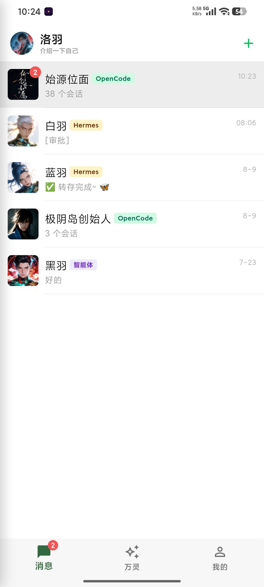

> 🎬 演示视频（B站）：[万灵 自托管 AI Agent 聊天系统，Hermes、OpenCode 插件一键接入](https://www.bilibili.com/video/BV1iFui6HEvS)

<iframe src="//player.bilibili.com/player.html?bvid=BV1iFui6HEvS&autoplay=0&high_quality=1&danmaku=0" scrolling="no" border="0" frameborder="no" framespacing="0" allowfullscreen="true" width="100%" height="420"></iframe>

---

## 为什么是万灵

AI Agent 越来越强,但它跑在终端里:每跑一步等你批权限,每次提问等你回话——**你必须守在屏幕前,人一走开,Agent 就停摆**。

万灵把 Agent 从终端搬进 IM:执行进度实时流进会话,审批卡、问答卡推到手机,系统通知提醒——地铁上、饭桌上,**点一下就放行**。

需要新功能甚至不用等版本:跟 Agent 说一句,它**现场开发小程序、自动发布**,你点开就能用。

## 核心特性

**📱 随时随地管 Agent**
审批卡、问答卡远程决策,APP 与终端双端状态同步;系统级通知推送,未读红点不漏消息。

**💬 IM 级对话体验**
多个 Agent 像好友一样添加,动态底栏 pin 会话/小程序、自定义排序;流式输出,Markdown · LaTeX · 代码高亮;图文混合消息,文件收发与全屏预览;草稿缓存、撤回、多选删除。

**🔍 Agent 过程全透明**
reasoning 思考过程、工具调用卡片、子 Agent 派发、文件 diff 全部实时渲染,执行不黑箱。

**🔗 OpenCode 深度桥接**
项目/会话列表直读,Build/Plan 模式反向切换,cwd 与 git 分支实时展示,token 上下文占用一目了然。

**🧩 小程序**
Agent 现场开发、自动发布:H5 轻应用容器,分享卡片一键传播;openid 身份、包签名验签、审核上架;云数据带配额与档位鉴权,WS 实时推送。

**🔐 安全治理**
扫码配对,子密钥授权可随时吊销;敏感操作审批前置,危险命令/工具调用/文件访问先过你这一关;SQLCipher 本地数据库加密。

## 一览

| 审批通知 | 问答 | 聊天执行中 | 小程序列表 | 子Agent | OpenCode 项目 | OpenCode 会话 | 命令面板 | 文件预览 | 安全审批 | 更多菜单 |
|---|---|---|---|---|---|---|---|---|---|---|
|  | 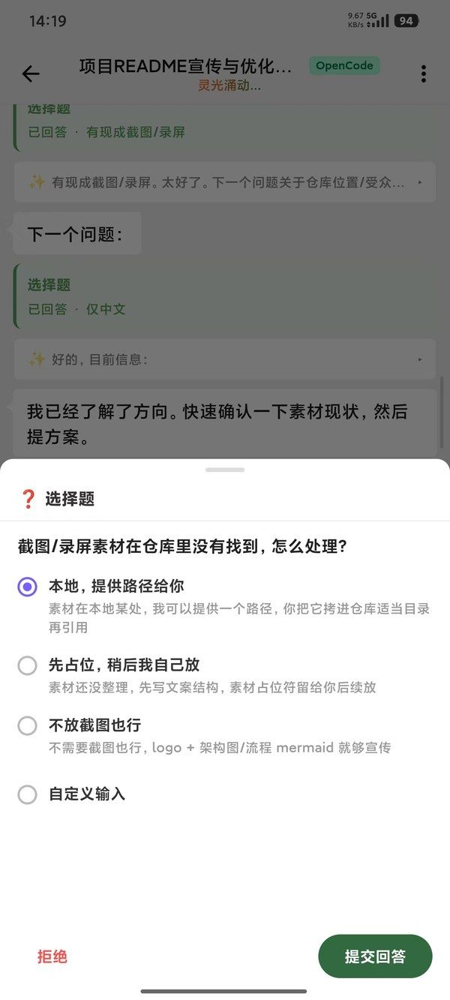 | 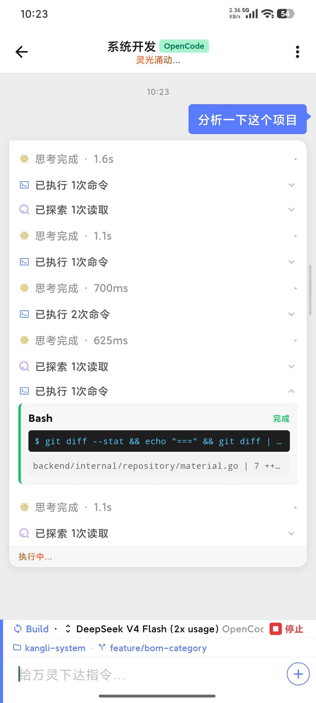 | 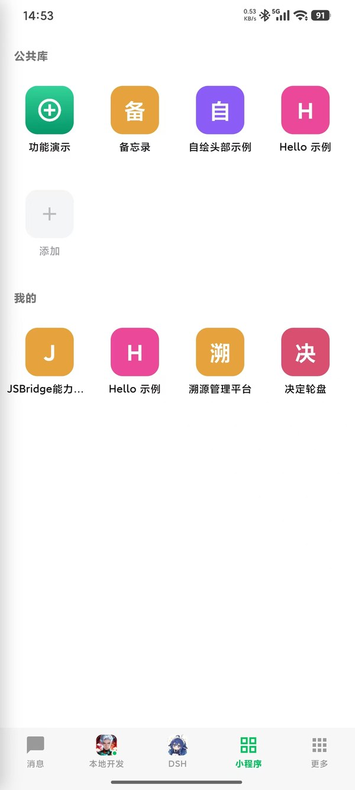 | 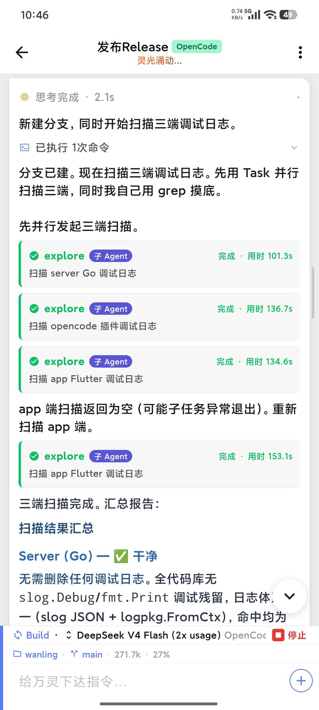 | 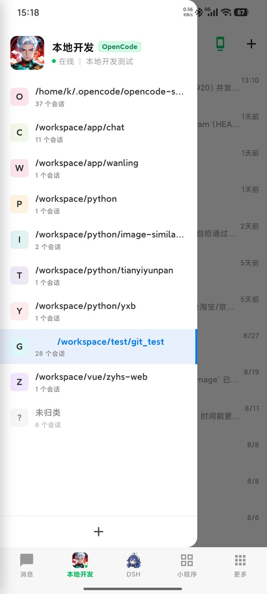 | 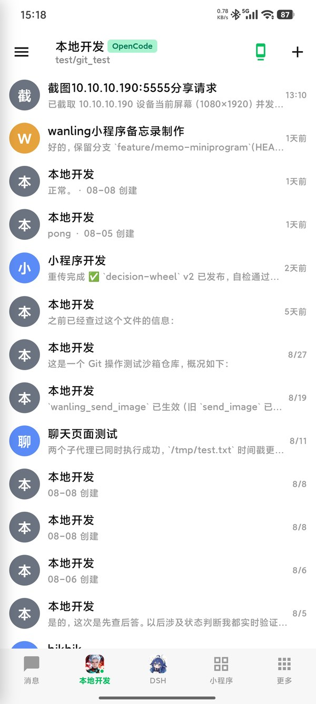 | 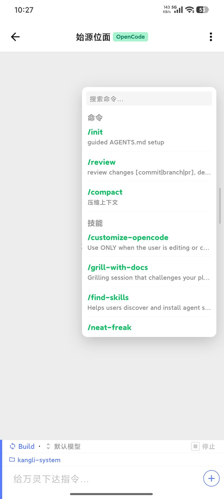 | 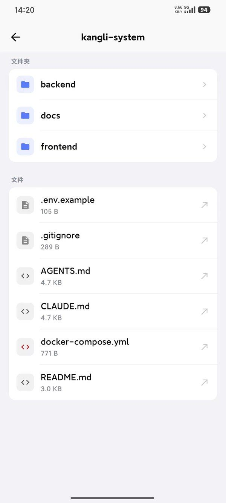 | 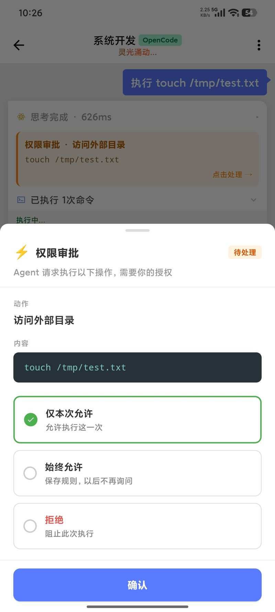 | 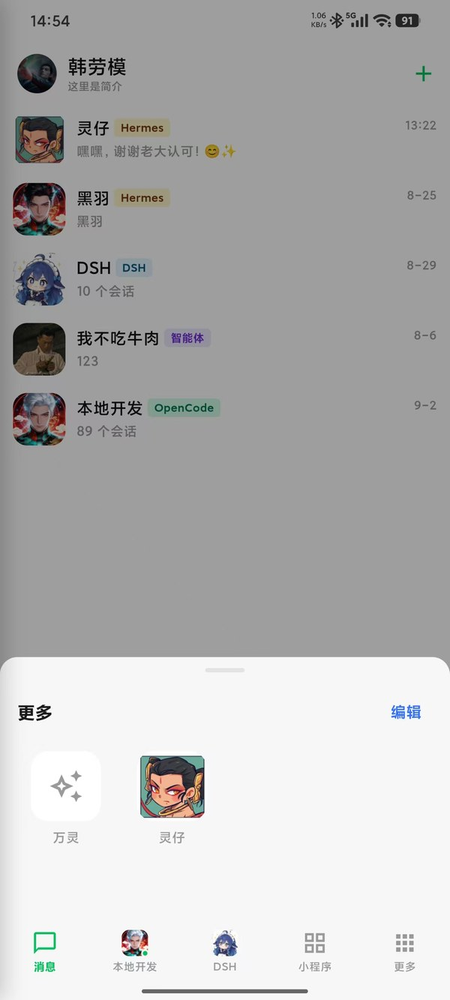 |

## 架构

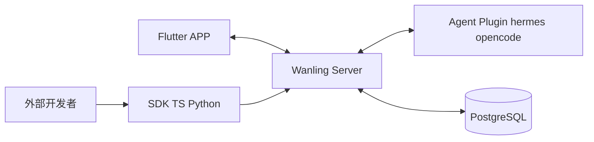

- 服务端仅做消息转发与用户/Agent 管理,不含 Agent 适配层
- 详细架构、协议、数据库设计见 [CLAUDE.md](CLAUDE.md)

## 快速试玩

**Docker Compose(推荐)**:

```bash
cp docker-compose.example.yml docker-compose.yml
cp .env.example.docker .env && vim .env   # 填 POSTGRES_PASSWORD / JWT_SECRET
docker compose up -d

docker compose run --rm --entrypoint /app/wanling-admin server add-user --username=alice --password=secret123
```

**或 systemd 源码部署**:见 [docs/deployment-source.md](docs/deployment-source.md)。

## 把任意 Agent 接进来

服务端零 Agent 适配层,不绑定具体 LLM,三层接入路径由浅入深:

**1. 现成插件** — hermes / OpenCode 插件即装即用,扫码配对,见 [plugin/README.md](plugin/README.md)。

**2. 双语言 SDK** — 接入自有 Agent 或任何 Agent 平台,连接生命周期、断线补发、流式输出、审批问答 RPC 全有封装,`npm install wanling-sdk` / `pip install wanling-sdk`,几行代码收到消息回 markdown:

```ts
import { WanlingClient } from "wanling-sdk"

const client = new WanlingClient({ serverUrl, agentId, secretKey })
client.on("message", async (msg) => {
  await client.sendTypedMessage(msg.conversation_id, "markdown", { text: "收到!" })
})
await client.connect()
```

完整脚手架见 [sdk/README.md](sdk/README.md)。

**3. Agent 技能** — 装好即具备发小程序、会话发图等能力,多平台一键安装:

```bash
# 安装全部技能(默认给 OpenCode;--target 指定平台,逗号分隔)
bash <(curl -fsSL https://gitee.com/luoyu318/wanling/raw/main/skills/install.sh) --target opencode,claude,hermes
```

凭据语义与子密钥吊销见 [skills/README.md](skills/README.md)。

## 文档

| 想了解什么 | 看哪 |
|---|---|
| 完整部署(Docker)  | [docs/deployment-docker.md](docs/deployment-docker.md) |
| 完整部署(源码/systemd) | [docs/deployment-source.md](docs/deployment-source.md) |
| 小程序开发指南(包格式 / JSBridge / 云数据) | [docs/miniprogram-dev-guide.md](docs/miniprogram-dev-guide.md) |
| 文档站源码(Starlight,部署后托管在 `/docs/` 路径) | [docs-site/](docs-site/) |
| 项目全貌 + 架构 + 协议 + 数据库设计 | [CLAUDE.md](CLAUDE.md) |
| Agent 平台接入插件(hermes / opencode) | [plugin/README.md](plugin/README.md) |
| Agent 技能(安装 / 编写 / 凭据) | [skills/README.md](skills/README.md) |
| 外部开发者用 SDK 接入 Agent(TS + Python) | [sdk/README.md](sdk/README.md) |
| nginx 反代模板 + certbot 续期 | [deploy/nginx/README.md](deploy/nginx/README.md) |

## License

本项目采用多协议分发：

| 组件 | 协议 |
|---|---|
| server / app / desktop / wanling_core / skills 及仓库其余部分 | [AGPL-3.0](./LICENSE) |
| sdk / plugin | [Apache-2.0](./sdk/LICENSE) |

Copyright (c) 2026 洛羽 (Luo Yu) <xiaoyu8098@agent.qq.com>。向本仓库提交贡献即视为接受 [CLA](./CLA.md)（见 [CONTRIBUTING.md](./CONTRIBUTING.md)）。
