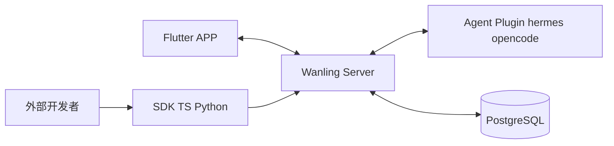

# 万灵 Wanling

> **万物有灵,唤灵即应。**

一个**自托管的 AI Agent 聊天系统**——像主流 IM 一样,把代码助手、陪练外教、知识库管家……多个 AI 同时装进同一个 APP 里,随时召唤,实时对话。

**自托管 · 不绑定具体 LLM · 标准 WS 协议接入 Agent**

[](./LICENSE)
[](./sdk/LICENSE)


> 🎬 演示视频（B站）：[万灵 自托管 AI Agent 聊天系统，Hermes、OpenCode 插件一键接入](https://www.bilibili.com/video/BV1iFui6HEvS)

<iframe src="//player.bilibili.com/player.html?bvid=BV1iFui6HEvS&autoplay=0&high_quality=1&danmaku=0" scrolling="no" border="0" frameborder="no" framespacing="0" allowfullscreen="true" width="100%" height="420"></iframe>

---

## 这是什么

现在市面上每个 AI 都是孤岛:写代码用一个、练口语用一个、查资料用一个,开一堆 APP、切一堆账号。

万灵让你**只装一个 APP,像添加好友一样把不同 AI Agent 加进来**,统一对话、统一管理:

- **万**:想接多少个 Agent 都行,不同模型、不同人设、不同用途,统一管理
- **灵**:每个 Agent 都是一个独立、有灵性的智能体,像 IM 里不同的好友

## 核心特性

**💬 对话体验**
IM 风格对话界面,流式输出、未读红点、置顶、撤回、多选删除、Markdown · LaTeX · 代码高亮、图片画廊长按保存。

**🤖 Agent 管理**
一个用户接多个 Agent,各自独立 secret_key;扫码授权即配对,过期自动失效。

**🔐 安全治理**
Agent 执行敏感操作(危险命令 / 工具调用 / 文件访问)前,先发**审批卡片**给你决策——APP 与终端双端状态同步。

**🔌 开放生态**
Agent 平台走标准 WebSocket 协议接入,服务端不绑定具体 LLM;内置 hermes / OpenCode 插件,双语言 SDK(TS + Python)让外部开发者一键接入自家 Agent。

## 一览

| 审批通知 | 问答 | 安全审批 | OpenCode 项目 | OpenCode 会话列表 | 文件预览 | 聊天执行中 | 命令面板 | 子Agent | 小程序列表 | 更多菜单 |
|---|---|---|---|---|---|---|---|---|---|---|
|  |  |  |  |  |  |  |  |  |  |  |

## 架构



- 服务端仅做消息转发与用户/Agent 管理,不含 Agent 适配层
- 详细架构、协议、数据库设计见 [CLAUDE.md](CLAUDE.md)

## 快速试玩

**Docker Compose(推荐)**:

```bash
cp docker-compose.example.yml docker-compose.yml
cp .env.example.docker .env && vim .env   # 填 POSTGRES_PASSWORD / JWT_SECRET
docker compose up -d

docker compose run --rm --entrypoint /app/wanling-admin server add-user --username=alice --password=secret123
```

**或 systemd 源码部署**:见 [docs/deployment-source.md](docs/deployment-source.md)。

## Agent 技能

内置可安装的 **Agent 技能**（SKILL.md + 脚本），装好后 agent 自动发现并具备对应能力，支持 OpenCode / Claude Code / Codex / Gemini / Copilot / Hermes 多平台软链分发：

- **wanling-miniprogram-publish** — 编写并发布小程序：包格式规范、JSBridge 能力与直传上传全流程
- **wanling-send-image** — 在会话中发图：本地截图/文件与远程图片均可，输出可点击放大的图片消息

一键远程安装（无需克隆仓库）：

```bash
# 安装全部技能(默认给 OpenCode;--target 指定平台,逗号分隔)
bash <(curl -fsSL https://gitee.com/luoyu318/wanling/raw/main/skills/install.sh) --target opencode,claude,hermes

# 附:扫码授权技能凭据(子密钥,仅无宿主 env 的外来平台需要)
bash <(curl -fsSL https://gitee.com/luoyu318/wanling/raw/main/skills/install.sh) --setup
```

凭据语义:宿主 agent 内跑技能自动用宿主身份（hermes / OpenCode 均为 env 注入，各 agent 独立互不共享）；`--setup` 发放的子密钥 REST-only，可随时在 APP「我的 → Agent → 授权密钥」单独吊销。详见 [skills/README.md](skills/README.md)。

## 文档

| 想了解什么 | 看哪 |
|---|---|
| 完整部署(Docker)  | [docs/deployment-docker.md](docs/deployment-docker.md) |
| 完整部署(源码/systemd) | [docs/deployment-source.md](docs/deployment-source.md) |
| 项目全貌 + 架构 + 协议 + 数据库设计 | [CLAUDE.md](CLAUDE.md) |
| Agent 平台接入插件(hermes / opencode) | [plugin/README.md](plugin/README.md) |
| Agent 技能(安装 / 编写 / 凭据) | [skills/README.md](skills/README.md) |
| 外部开发者用 SDK 接入 Agent(TS + Python) | [sdk/README.md](sdk/README.md) |
| nginx 反代模板 + certbot 续期 | [deploy/nginx/README.md](deploy/nginx/README.md) |

## License

本项目采用多协议分发：

| 组件 | 协议 |
|---|---|
| server / app / desktop / wanling_core / skills 及仓库其余部分 | [AGPL-3.0](./LICENSE) |
| sdk / plugin（生态接入层，允许嵌入闭源产品） | [Apache-2.0](./sdk/LICENSE) |

Copyright (c) 2026 洛羽 (Luo Yu) <xiaoyu8098@agent.qq.com>。向本仓库提交贡献即视为接受 [CLA](./CLA.md)（见 [CONTRIBUTING.md](./CONTRIBUTING.md)）。
