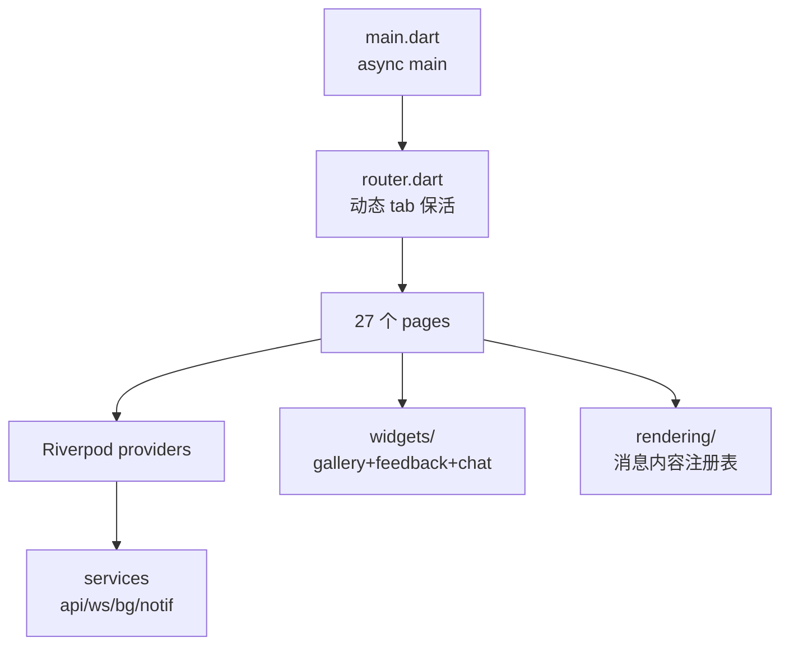

# app/CLAUDE.md

万灵 Flutter APP,动态底部 tab IM 风格(消息/万灵固定 + 可 pin 多会话 agent,溢出收进更多抽屉),仅 Android 发布。Claude Code 在 app/ 目录工作时自动加载本文件 + 根 CLAUDE.md。

## 子系统身份

Flutter APP,动态底部 tab IM 风格(消息/万灵固定 + 可 pin 多会话 agent,溢出收进更多抽屉),**仅 Android 发布**(Linux desktop 不支持)。

## 开发命令

```bash
cd app
flutter pub get                    # 安装依赖（需 PUB_HOSTED_URL=https://pub.flutter-io.cn）
flutter run -d <device-id> --flavor dev  # Android 真机/模拟器（adb devices 看 device-id）
flutter build apk --release --flavor prod  # 输出 build/app/outputs/flutter-apk/app-prod-release.apk
flutter test                       # 运行测试
flutter test test/providers/...    # 运行指定目录测试
```

> **真机装 APK 用 `adb install -r` 覆盖安装(保留登录态/缓存/DB),不要用 `flutter install`(它会 uninstall+install 清掉本地数据)**:
> ```bash
> adb -s <device-id> install -r app/build/app/outputs/flutter-apk/app-prod-release.apk
> adb -s <device-id> shell am start -n com.wanling.app/.MainActivity
> ```
> 仅在签名不一致报 `INSTALL_FAILED_UPDATE_INCOMPATIBLE` 时才先卸载。

> `pubspec.lock` 镜像源必须保持 `pub.flutter-io.cn`，否则 commit 会被污染。运行时务必 export `PUB_HOSTED_URL` 和 `FLUTTER_STORAGE_BASE_URL`。
>
> **Android 构建注意**：`android/build.gradle.kts` 用腾讯云 + Maven Central 兜底镜像；首次构建会下载 Gradle + Android SDK 组件，耗时较长。涉及 native 插件（`flutter_local_notifications` / `flutter_background_service` / `wechat_assets_picker` / `wechat_camera_picker` 等）改动后，需同步 macOS 主工程插件注册（`MainFlutterWindow.swift`）和 Android 的 `MainActivity.kt`。
>
> **wechat_camera_picker 构建**：它间接拉 `sensors_plus 7.x`（需 Kotlin 2.2），但项目用 Flutter Built-in Kotlin（2.0）。`pubspec.yaml` 的 `dependency_overrides` 固定 `sensors_plus: ^6.1.1` 解决。若升级 Flutter 触发 Kotlin 版本变更，需重新评估此 override。

## 架构(概要)



详细组件清单(逐个 lib/ 子目录职责 + 关键设计点)见 [@../docs/architecture/app.md](@../docs/architecture/app.md)

## 测试规约

- 单元/widget 测试用 `mocktail` + `test/helpers/mock_adapter.dart`（含 `MockHttpClientAdapter` 和 `CapturingMockAdapter`）。
- `test/helpers/fake_ws.dart` 提供 `FakeWS extends WebSocketService`，用 StreamController 模拟消息流。
- E2E 测试在 `test/e2e/`，验证路由 redirect + 底部导航（tab 切换 / pin-unpin / 拖拽排序 / 更多抽屉）。
- **Lint**: `cd app && flutter analyze`（配置见 `app/analysis_options.yaml`，vendored photo_view 豁免）
- **模板**: 新增 provider/page/service/model 从 `templates/flutter-*.tmpl` 复制骨架
- **本地 DB 加密回归**: 改 pubspec.yaml 的 `hooks.user_defines` / `sqlite3` 版本后,必须验证 APK 中 native 库 + 真机 DB 文件头:
  - APK 拆包: `lib/<abi>/libsqlcipher.so` 存在(SQLCipher 编译版,sqlite3 包按 source 类型命名:source=sqlcipher → libsqlcipher.so),`libsqlite3.so` 不存在
  - 真机 DB: `adb shell run-as com.wanling.app.dev head -c 16 app_flutter/messages_*.sqlite | xxd` 不应以 `5351 4c69 7465 2066 6f72 6d61 7420 3300`(SQLite format 3) 开头
- **SQLCipher wiring 测试缺口(已知限制)**: `pubspec.yaml` 的 `hooks.user_defines.sqlite3.source` 对 host linux x64 test runner 同样生效,`flutter test` 环境强制加载 SQLCipher(`PRAGMA cipher_version` 返 `4.17.0 community`),**无法在测试体系内制造"未装 SQLCipher"场景**测 `_openWithKey` setup 回调的 wiring regression。当前保护层:(1) `validateSqlCipher` 单元测试覆盖 if/throw 分支;(2) Task 5 真机回归取证。改 `_openWithKey` 时务必人工 review 保留 `validateSqlCipher(rawDb)` 调用。

## 跨系统协议

@../docs/architecture/overview.md
@../docs/ai-handbook/websocket-protocol.md
@../docs/ai-handbook/aggregate-card.md
@../docs/ai-handbook/approval-card.md
@../docs/ai-handbook/qr-pair.md
@../docs/ai-handbook/rest-response.md
