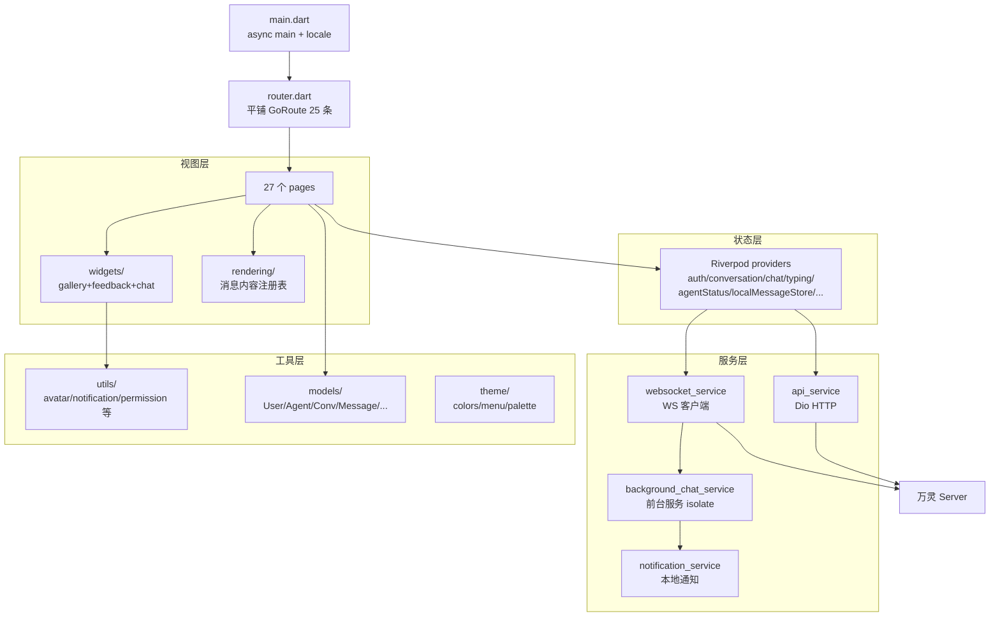

# APP 架构

Flutter APP,动态底部 tab IM 风格(消息/万灵固定 + 可 pin 多会话 agent,溢出收进更多抽屉),仅 Android 发布。

## 子系统拓扑

## 组件清单

### 入口与路由
- `lib/main.dart` — 入口,runApp 前调 restoreSession(zh locale 固定)。详见 [entry.md](./app/entry.md#maindart)
- `lib/router.dart` — GoRouter 平铺路由(25 条)+ 25 路由统一横向平移转场;动态底栏由 HomePage 内嵌 NestedPageView 保活。详见 [entry.md](./app/entry.md#routerdart)
- `lib/router_helpers.dart` — chatRoute 拼路径 + startChatAndPush 统一跳转。详见 [entry.md](./app/entry.md#router_helpersdart)

### Services
- `lib/services/api_service.dart` — Dio HTTP 封装(401 自动 refresh + 重试,失败才登出)。详见 [services.md](./app/services.md#api_servicedart)
- `lib/services/websocket_service.dart` — WebSocket 客户端,完整 Opcode 协议 + 自动重连 + OpResume + tokenRefresher(重连前自动刷新过期 token)。详见 [services.md](./app/services.md#websocket_servicedart)
- `lib/services/background_chat_service.dart` — Android 前台服务,后台/被杀仍收消息(独立 isolate + IPC 同步 activeConv / myUserId / lifecycle / agentAvatar / requestTokenRefresh)。详见 [services.md](./app/services.md#background_chat_servicedart)
- `lib/services/secure_storage.dart` — TokenVault(flutter_secure_storage 封装,存 access/refresh token + 用户凭证)。详见 [services.md](./app/services.md#secure_storagedart)
- `lib/services/notification_service.dart` — flutter_local_notifications 封装,后台收消息弹通知 + 智能单例跳转。详见 [services.md](./app/services.md#notification_servicedart)
- `lib/services/file_download_service.dart` — 聊天文件下载管理器,进度流 + 取消 + fileId 校验(v1.0.6)。详见 [services.md](./app/services.md#file_download_servicedart)
- `lib/services/mini_program_bridge.dart` — 小程序 JSBridge 门禁(token 不进 JS/权限 fail-fast/`/api/` 路径白名单),`wanling_core` 的 `MiniProgramService` 负责本地包管理(下载/sha256 校验/解压/原子替换)。详见 [services.md](./app/services.md#mini_program_servicedart)

### Providers(Riverpod)
- `lib/providers/` — 状态管理 19 个 provider:auth / agentList / conversation / chat / settings / savedLogins / typing / agentSessions / agentTabUnread / navOrder / agentStatus / fileBrowser / friend / participant / sessionDiff / userSearch / localMessageStore / draft / miniPrograms(connState 定义在 chat_provider 内,非独立文件)。详见 [providers.md](./app/providers.md)

### Pages
- `lib/pages/` — 27 个 page(含 `pages/chat/` 子目录),核心:Splash / Login / SelectAccount / Home / Messages / AgentList / AgentDetail / AgentSessions / Chat / SubagentDetail(v1.0.10) / ConversationDetail(v1.0.12,按 type 分流 agent_session/dm_user_agent) / chat/FileBrowser(单栏 iOS Files 风格) + chat/FilePreview(全屏文件预览) / SessionDiff / SessionDiffFile / UserDetail / FriendsList / AddFriend / ScanPair / PairSelectAgent / CreateGroup / EditProfile / CropAvatar / ChangePassword / About / MiniProgramList / MiniProgram。详见 [pages.md](./app/pages.md)

### Rendering
- `lib/rendering/` — 消息内容渲染器体系(注册表模式):renderer 接口 + 内置(text/markdown/image/file/card) + Agent 过程渲染器(tuiUser/reasoning/toolCall/toolResult/toolError/subagent/question/stepFinish/fileDiff, v1.0.7) + tool_card_renderer(v1.0.10,工具调用统一卡片 + task 4 状态机 + read 高亮视图)。详见 [rendering.md](./app/rendering.md)

### Theme
- `lib/theme/` — 设计 token 集合:app_colors(色板)/ app_menu_style(深色菜单)/ account_palette(8 色账号标记)。详见 [theme.md](./app/theme.md)

### Widgets
- `lib/widgets/` — 组件库,含 Avatar / MarkdownView 等核心 widget + gallery/(画廊 + 内化 photo_view)+ feedback/(统一反馈组件)+ chat/(聊天页专属 widget + controller,详见 [chat-components.md](./app/chat-components.md))。v1.0.9+ 新增(目录面板/三体指示器/文件浏览/命令面板)详见 [chat-extras.md](./app/chat-extras.md)。详见 [widgets.md](./app/widgets.md)

### Utils
- `lib/utils/` — 工具集合:app_lifecycle_observer / avatar_bitmap / diff_merge / dio_error / emoji_editing_controller / emoji_span / gallery_image / image_cache_key / image_normalizer / notification_payload / permission_helper / reconnect_backoff / secure_storage / snackbar / file_format(v1.0.6)。chat/ 子目录:gallery_opener / message_preview / render_box_utils / unread_tracker(ChatPage 抽离工具)。详见 [utils.md](./app/utils.md)

### Models
- `lib/models/` — 数据模型:User / Agent / Conversation / Message / WSMessage / Approval / Pairing / SavedLogin / AccountMark / UnreadInfo。wanling_core 另有 `MiniProgramInfo`(小程序注册条目)。详见 [models.md](./app/models.md)
