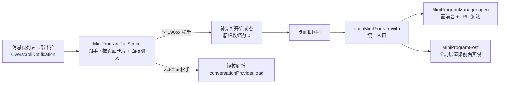

# APP 入口与路由

main.dart + router.dart + router_helpers.dart。

## main.dart

入口。`async main` 在 runApp 前调 `restoreSession` 拉用户信息，避免首帧渲染时 auth 状态未定。`MaterialApp.router` 固定 `locale: Locale('zh')` + `supportedLocales: [zh]` + Material/Widgets/Cupertino 三套 `localizationsDelegates`（让内置组件和第三方插件拿到 zh locale，否则 wechat_assets_picker 会因 Flutter 默认 supportedLocales=[en,US] 被解析成英文）。**`builder` 挂全局小程序保活层**：`MiniProgramHost` 包住 Navigator 产物，实例 WebView 常驻 Offstage 保活；无实例时纯透传不影响既有页面（见 [mini-program.md](./mini-program.md)）。

## router.dart

GoRouter 配置。3-tab 保活由 `HomePage` 内嵌 `NestedPageView` 实现（外层万灵↔我的 + 内层消息↔万灵，`AutomaticKeepAliveClientMixin` 保活），router 层是 28 条平铺 `GoRoute`。redirect 根据 `authProvider.isAuthenticated` 守卫。**转场动画**：路由统一用 `pageBuilder` + `CustomTransitionPage` + 手写 `SlideTransition`（横向平移，200ms，easeOut），替代 Material 3 默认的 Zoom 缩放转场，对齐主流 IM 利落手感。用 `_cupertinoPage` 工厂统一构建，**每个 pageBuilder 必须传 `key: state.pageKey`**（否则 pushReplacement 时新旧 page key 相同，Flutter 复用旧 State，新页 initState/_markRead 不触发——曾导致「通知跳转后未读不清」bug）。取舍：放弃 iOS 边缘左滑跟手返回（`TransitionsBuilder` 签名无 route 参数挂不了手势）。

**小程序壳路由**（多任务保活，详见 [mini-program.md](./mini-program.md)）：`/mini-program/:appid` = 入口壳（`MiniProgramLaunchPage`，页面无 UI，initState 经 `openMiniProgramWith` 拉起保活实例 + WebView 由全局 Host 层渲染）；`/mini-program-live/:appid` = live 壳（`MiniProgramLiveShellPage`，仅拦系统返回键=最小化，由 launcher 压栈/弹出）。

**关键路由顺序约束**(v1.0.10): `/chat/subagent/:taskCardId` 必须排在 `/chat/:convId` 之前,否则 GoRouter 把 path 第一段 'subagent' 当成 `:convId` 匹配(对齐 `/conversations/new/group` vs `/conversations/:id/detail` 模式)。subagent 路由的 convId 走 query 参数,空 convId/taskCardId 时 pageBuilder 内 fail-fast 返错误页(避免 api_service 拼出空路径段让 server Gin 行为未定义)

## router_helpers.dart

`chatRoute(convId, agentId)` 拼路径 + `startChatAndPush(context, ref, agent)` 统一 findOrCreate + 跳转。

## 消息页下拉 → 小程序面板数据流

消息页顶部下拉拉出小程序面板（用户侧快捷入口，独立于小程序内部交互）：

- 手势/三档分档/完成态收回全在 `MiniProgramPullScope`（`mini_program_pull_panel.dart`）；完成态经 `panelOpenNotifier`（ValueNotifier<bool>）通知 HomePage 把底栏收到 0，切页/外部复位双向同步防「收起态底栏带到其他 tab」
- 点面板图标 → `openMiniProgramWith`（launcher 统一入口）→ Manager 置前台 + Host 全局层接管渲染，面板同时收回
- 组件细节见 [mini-program.md](./mini-program.md)
