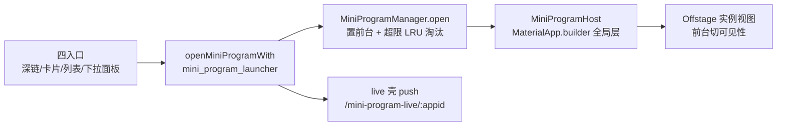

# 小程序多任务保活层

小程序多实例保活（branch `feature/miniprogram-multitask`）：实例 WebView 常驻全局层 Offstage，前台只切换可见性；最小化不销毁（JS 继续跑），LRU 上限 5。服务层（manager/launcher）见 [services.md](./services.md)，页面见 [pages.md](./pages.md)。

## 数据流：打开路径归一

四入口（深链 `/mini-program/:appid` / 聊天卡片 / 列表页 / 消息页下拉面板）全部收敛到 launcher：

- **launcher 不变式**：`_liveActive`（模块级布尔）保证「manager 有前台 ⇔ live 壳在栈」；壳在栈时系统返回键被壳页消费=最小化。`syncLiveRouteWith` 在 Host 最小化/恢复/关闭后同步壳有无，弹出壳返 true 供壳页残余兜底判断。push 失败时复位占位并 debugPrint（不静默）
- **MiniProgramAutoMinimizeObserver**（`mini_program_nav_observer.dart`）：挂 `routerProvider` 的 `GoRouter.observers`，非小程序路由 didPush → 帧末最小化前台实例（微信语义「去别处=收起」，覆盖 openPage/通知点击/深链全部 push 来源）。壳路由识别靠 `route.settings.name`：router.dart 仅给两类壳路由显式 `name: state.matchedLocation`（go_router push 场景 pageKey 是唯一 id 非路径）；`/mini-programs` 列表页 name 为 null 照常收起。观察者不弹壳——此刻栈顶刚被本次 push 占据，`router.pop()` 会弹错路由，壳留栈下由残余壳兜底自清（返回链路多一次空白壳页按键，与双入口压栈场景同款语义）
- **MiniProgramHost**（`mini_program_host.dart`）：包在 `MaterialApp.builder`，永远盖在 Navigator 之上。Stack 四层：全部实例视图（`Offstage` 按 `ValueKey('mp-inst-<appid>-<openedAt 微秒>')` 键控——appid 维度防 list 前插/淘汰的槽位位移原位复用击穿保活；openedAt 维度区分参数变化销毁重建的新实例，WebView 整棵换新）→ 弹层宿主（见下节）→ 浮球（有后台实例且无前台时）→ 卡片多任务视图。Host 提供 `instanceViewBuilder` 注入点（测试替身用）
- **MiniProgramManager**（`mini_program_manager.dart`）：纯状态 ChangeNotifier（`maxInstances = 5`），`open` 返回被淘汰 appid（无淘汰 null）；`lastForegroundAt` 驱动 LRU；`open` 携带 `conversationId`/`launchParams` 元数据，重复打开且新参数非空且与现值不同 → 销毁重建实例（卡片语境正确性优先，重建丢 JS 状态可接受）；`closeAll` 清空全部实例+前台（幂等），由 Host 监听 `authProvider` 认证态从有到无时调用（登出/401 踢出/切换账号统一收敛），同时复位任务视图展开标志

## 嵌入模式弹层宿主（C1）

嵌入页面与 Navigator 是 Host Stack 的兄弟分支，context 向上无 NavigatorState，`showDialog`/`showModalBottomSheet` 必崩（debug 抛 FlutterError）。`mini_program_overlay.dart` 在 Host Stack 顶端挂专用全局 Overlay 作弹层宿主：

- `showMiniProgramOverlay`：插入带 barrier 的弹层条目（150ms 淡入），barrier 点击关闭，Future 在关闭时完成；`bottomSheet` 形态内容贴底。宿主未挂载 fail-fast 抛 StateError
- 4 处弹层接线（仅嵌入模式走宿主 Overlay，路由模式行为逐字不变）：胶囊 ⋯「更多」抽屉（`_buildMoreSheetContent` 与路由模式共享内容）→ `showAppDialog(embedded:)` 的 profile 授权/权限申请 → `showMiniProgramConversationPicker(embedded:)` 会话选择器
- 前台实例变化（最小化/切实例/关闭/登出）→ Host 监听 manager 批量关闭弹层（`dismissMiniProgramOverlaysOnForegroundChange`），防 barrier 悬浮在非小程序页面拦死宿主导航

## 返回键与关闭语义（嵌入模式）

- **WebView 有历史** → `goBack()` 逐级回退（`onUpdateVisitedHistory` 同步 `_canGoBack`，含 hash 同文档导航）
- **入口页返回** → `onMinimize`（前台清空 + live 壳弹出，实例保留）
- **胶囊 ⋯ 菜单「浮窗」**（仅嵌入模式）→ 主动最小化；**胶囊 ◉ / JS `wanling.close()`** → `onClose` 销毁实例（WebView 释放、壳弹出）
- **`wanling.openPage('home')`** → 转最小化到浮球；`openPage('miniPrograms'/'agentDetail')` 等宿主页跳转 → 观察者收起实例（push 的页面同帧可见），返回键可逐级回到小程序
- **残余壳兜底**（`MiniProgramBackScope`）：双入口压栈等场景下壳以 `canPop:false` 残留会拦死系统返回，回调内 sync 未弹壳且已无前台时 `Navigator.pop` 自弹

## 浮球 / 多任务视图

- **MiniProgramFloatBall**（`mini_program_float_ball.dart`）：吸附态 `Positioned` 只占露出宽度（`_size/3`），`OverflowBox` 让球体溢出、Stack 裁剪出「藏 2/3 露 1/3」，命中区域恰为可见部分；长按拖拽（y 钳制避开状态栏/屏底，多实例拖拽中显示数量角标），松手/取消就近吸附（球心半屏判定），手势被打断 `onLongPressCancel` 兜底防卡半空
- **MiniProgramTaskView**（`mini_program_task_view.dart`）：全屏遮罩（`0xE6141418`）+ 顶部实例 tab（横滑）+ `PageView` 卡片。`taskCardLayout` 纯函数：卡宽 0.74 屏宽、高按真实屏幕宽高比、`viewportFraction = (cardW+20)/屏宽`。点卡片/tab → 恢复前台（视图随关）；`Dismissible(direction: up)` 上滑销毁；点空白遮罩/系统返回关视图本身。展开期间为全屏遮罩，外部打开入口不可达（若未来新增绕行入口需同步收起视图）

## 消息页下拉面板

`mini_program_pull_panel.dart` 两个公开 widget，数据流概览见 [entry.md](./entry.md)：

- **MiniProgramPullScope**：包在消息页 body 外层，页面变顶层卡片（`Transform.translate` 跟手 + 顶缘圆角 `18*p` 渐现 + 黑 `0.18*p` 压暗），面板为底层（8%~45% 区间淡入 + 0.96→1.0 微缩放）。手势：`OverscrollNotification` 累积下拉（**顶部下拉 overscroll 为负值**；`axisDirection==down` + `pixels<=minScrollExtent` 三重守卫防横向轮播/中部回弹误触），松手三档：`>=190` 补完打开（`HapticFeedback.mediumImpact`）/ `>=60` 轻拉刷新（真 onRefresh + 最短 900ms 并行）/ `<60` 弹回
- 完成态：`_tMax = bodyH - 点指示器26 - 状态栏 - 页头(kToolbarHeight) - 底部手势条 inset`（inset 从 `View.of(context)` 取，外层 Scaffold 带 bottomNavigationBar 时 body 的 MediaQuery bottom 被剥掉）；页头条变纯返回条（`GestureDetector + AbsorbPointer`，点按/系统返回/上滑过半收回）；底栏由 HomePage 按 `panelOpenNotifier` 收缩（56+inset→0，`OverflowBox` 防收缩动画中间帧内容溢出），切页 `onPageChanged` 兜底复位，notifier 双向同步无回环
- **MiniProgramPanel**：`最近使用`（manager.list，元信息空回退查 miniProgramsProvider，空则整段隐藏）+ `常用的小程序`（miniProgramsProvider 前 8），4 列网格；点图标 → `openMiniProgramWith` 并收回
- 已知边界：iOS BouncingScrollPhysics 不产 OverscrollNotification（仅 Android 发布，无影响）；面板完成态收到 deep-link push 再返回，面板保持打开可正常收回

## SKILL 侧约定

小程序开发者视角的宿主交互语义（返回键/浮窗/多任务/存档指引）见 `skills/wanling-miniprogram-publish/SKILL.md`「二·六、宿主交互语义」；游戏类小程序应在关键节点写 localStorage 存档（LRU 淘汰/⊙ 关闭后内存态丢失，`beforeunload` 不可靠）
