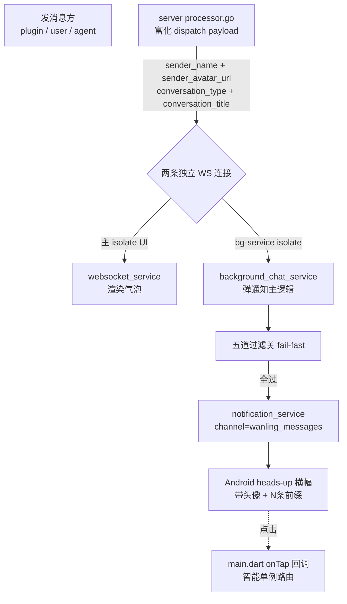

# APP Services

api_service / websocket_service / background_chat_service / secure_storage / notification_service / local_message_store / local_message_key / file_download_service。

## 系统通知横幅(端到端链路)

**Android 系统级 heads-up 通知**(`wanling_messages` channel,HIGH 优先级,弹横幅+声音+震动),由 bg-service 独立 isolate 收 WS MESSAGE_CREATE 后通过 `flutter_local_notifications` 弹出。**不是 APP 内 widget**——与 ConnectionBanner / LocalStoreBanner / FriendDeletedBanner 等无关,后者是 IM 主 UI 内的 MaterialBanner。

### 数据流

### bg-service 五道过滤关(`_handleMessage`)

按 fail-fast 顺序,前置不过即 return:

1. `msg.t != 'MESSAGE_CREATE'` 跳过(只关心消息)
2. `senderId == myUserId` 跳过(防自己 echo 弹通知;`_myUserId` 优先用 IPC 实时值,fallback prefs 兜底冷启动)
3. `isViewing = _appInForeground && convId == _activeConvId` 跳过(用户正在看该会话已直接看到)
4. `content.silent == true` 跳过(AI 思考/工具调用等过程类不打扰,但仍走主 UI 渲染)
5. `_unread.increment(convId)`(含本条计数后再组装通知)

### 通知组装(`showMessageNotification`)

- **id** = `convId.hashCode`(同会话覆盖更新不堆叠,5 条未读 = 1 条「[5条]」横幅不是 5 条)
- **title**:单聊 = senderName;群聊(`conversation_type=group_user/group_mixed`) = 群名;**agent_session** = 会话标题(APP 建会话时默认 `title=agent.name` 透传,空串仅极端 race 时 fallback senderName)
- **body**:单聊 = 消息预览;群聊 = `sender:内容`;**agent_session = 内容(不加 sender 前缀,单 agent 语义前缀冗余)**;N>1 前加 `[N条]`
- **largeIcon**:`loadAvatarBitmap` 四级兜底(内存 bitmap → 文件缓存 `avatar_cache/{agentId}.png` → Dio 下载 3s 超时 + 裁方 192x192 + 圆角 r=36 → 首字母色块)。agent_session 的 sender 永远是 agent(自己 echo 被过滤),`sender_avatar_url` 自然等同会话头像
- **payload**:JSON `{convId, agentId, agentName}` 点击路由用

msg_type 预览(`notification_payload` → `MsgTypeX.preview`):单一真相源纯函数,覆盖 22 种 msgType(text/markdown 截断 50 字 / image=`[图片]` / file=`[文件] 文件名` / card/mixed/agent 过程类型各有文案);返回 null 时通知 body fallback `[新消息]`(详见 [models.md](./models.md) `MsgTypeX`)。

### 通知取消三条路径(均 `cancel(convId.hashCode)`)

| 场景 | 触发链 |
|---|---|
| 进入会话读消息(不点通知) | ChatPage initState → `conversation_provider.setActiveConv(convId)` → IPC `setActiveConv` → bg-service `_unread.clear + cancel` |
| 点击通知跳转 | 系统 → `notification_service._onTap` → `main.dart` onTap 回调 → `router.push('/chat/...')` → ChatPage → 触发上条链路取消 |
| 冷启动从通知拉起 | `getNotificationAppLaunchDetails` → `_launchPayload` → `router.dart` 已登录时消费 → ChatPage → 取消 |

### IPC 同步(主 isolate → bg-service,6 个 handler)

bg-service 跑在独立 isolate,**SharedPreferences 各 isolate cache 独立**,volatile state 必须显式 IPC 同步(关键陷阱):

| handler | 触发源 | 作用 |
|---|---|---|
| `setAppLifecycle` | `AppLifecycleObserver.didChangeAppLifecycleState` + attach 启动同步 | `_appInForeground`(过滤关 3) |
| `setActiveConv` | ChatPage enter/leave → `conversation_provider.setActiveConv` | `_activeConvId`(过滤关 3 + 取消通知 + 未读清零) |
| `syncAgentAvatar` | `conversation_provider.syncAgentAvatarsToBgService`(拉列表后) | agent 头像 URL(旧链路;server sender_avatar_url 主路径上线后仅老 server 退化用) |
| `setMyUserId` | auth_provider login/logout/restoreSession | `_myUserId`(过滤关 2 防 echo 误弹,不直接读 prefs 因 cache 隔离) |
| `start` / `stop` | auth_provider login/logout | bg-service WS 连接生命周期(传 baseUrl + token) |
| `requestTokenRefresh`(反向 bg→主) | bg-service 连续 3 次重连失败触发 | 请求主 isolate refresh token(bg 不能直接调 ApiService);主 isolate refresh 后通过 `start` IPC 传新 token 回来 |

### 关键设计要点

1. **双 WS 连接**:主 isolate UI 一条,bg-service isolate 一条。server 富化字段(`sender_avatar_url` 等)让 bg-service **首次接收消息**也能拿到正确头像,不依赖 UI IPC 同步时机
2. **防 echo 误弹**(过滤关 2):`_myUserId` 用 IPC 实时同步,**不直接读 prefs**——主 isolate login 写入不自动同步到 bg-service isolate 的 cache
3. **防"在会话里仍弹通知"**(过滤关 3):`_appInForeground` 默认 `true`(IM 启动惯例假设前台),`AppLifecycleObserver.attach()` 启动后立即 invoke 一次同步兜底(observer 仅在状态变化时触发,APP 一直前台时 isolate 永远是默认值)
4. **点击路由智能单例**(`main.dart` onTap):栈顶已是 `/chat/X` → `router.pushReplacement('/chat/Y')`(避免叠加 + 避免 setActiveConv 竞态);否则 `router.push`(保留页面层级,如从设置页点通知返回仍回设置页)。**注意**:ChatPage 是 push 出来的栈帧(基础 location 仍是 `/`),不能用 `router.replace`(replace 替换路由目标 URI 不替换 push 栈帧,栈仍叠加)
5. **token 过期自愈**:连续 3 次重连失败 → 反向 IPC `requestTokenRefresh` → 主 isolate refresh → `start` IPC 传新 token → 下次重连用新 token

---

## secure_storage.dart

**TokenVault** — `flutter_secure_storage` 封装,Android Keystore 加密存储 JWT token + 用户凭证。存 access_token / refresh_token / user_id / cached_user。access_token 双写 SecureStorage + SharedPreferences(bg-service isolate 平台通道受限,需从 prefs 读 token 做 WS auto-restore;access TTL 仅 2h 暴露窗口短)。refresh_token 仅存 SecureStorage(高价值 30d token)。测试环境用 `FlutterSecureStorage.setMockInitialValues({})` 注入内存实现。**命名区分**:与 `utils/secure_storage.dart` 的 `SecureStorage`(AES-GCM 加密 helper,多账号存储用)不同,本类专注 token 凭证的 Keystore 存储。

## file_download_service.dart

**文件下载管理器**(v1.0.6)。聊天页接收方点击文件卡片时,由此 service 走 dio 下载到 app persistent 目录(`getApplicationDocumentsDirectory()/downloads/<fileId>`)。**进度流式暴露**:`downloadWithProgress(fileId)` 返回 `Stream<DownloadProgress>`,UI(FileCard)订阅实时显示百分比。**取消支持**:`cancel(fileId)` 通过 `CancelToken` 中断 dio download,流静默关闭。**防御性 fileId 校验**:`^[a-zA-Z0-9_-]+$` 正则白名单,拒绝路径注入式 file_id(如 `../../etc/passwd`)。**幂等查询**:`getLocalPath(fileId)` 先查内存 cache 再查磁盘,已下载直接返路径不重下。ChatPage 持有此 service 实例,把进度通过 `MessageRenderContext.fileDownloadSnapshots` 注入到 FileCard。下载完成调 `OpenFilex.open(path)` 用系统应用打开

## api_service.dart

Dio HTTP 封装。含 `@visibleForTesting withDio` 构造和 dio getter。**401 自动 refresh 拦截器**:401 时检查是否有 refresh_token → 有则调 `POST /api/auth/refresh`(Completer 去重,并发请求共享一个 refresh)→ 成功更新 token + 重试原请求(单次 retried 防循环)→ 失败(401)才触发全局登出回调。`isRefresh` 标记防 refresh 请求自身 401 递归。`tryRefreshToken()` public 方法供 WebSocketService.tokenRefresher 调用。`logout()` 调 server 黑名单 + 删 refresh。`changePassword()` 返回新 token pair。

## websocket_service.dart

WebSocket 客户端，实现完整 Opcode 协议 + 自动重连 + OpResume 补发。**tokenRefresher 回调**:`_reconnect()` 重连前调用,如果 token 过期(2h TTL)则自动调 `api.tryRefreshToken()` 拿新 token 再重连,避免 token 过期后 WS 重连死循环。`updateToken(token)` 方法供 token refresh 时直接更新内存 token(避免 wsProvider 重建断连)。F4 接入 LocalMessageStore：dispatch 事件 fire-and-forget 持久化（`_persistToStore` 调 putMessage / markRecalled / deleteMessage / updateContent / setGlobalLastSeq 等），连续失败 3 次通过 `localStoreHealthStream` 通知 UI 显示 amber 色 LocalStoreBanner；hello 分支读 `store.getGlobalLastSeq()` 作 Resume `last_seq`，断线补发缺口。**事件分流**:dispatch 按 `msg.t` 分流到 7 个独立 StreamController(`messages` / `typingStream` / `messageUpdates` / `conversationUpdates` / `friendUpdates` / `messageReads` / `sessionMetaUpdates`),各 provider 按需订阅,避免 chatProvider 把 UPDATE 当 CREATE 重复插入或把 MESSAGE_READ 当 CREATE echo。`messageReads` 流承载多端已读同步事件(A 设备 markRead → server 推 MESSAGE_READ → B 设备刷徽章 + firstUnread);`sessionMetaUpdates` 流承载 agent_session 元数据实时刷新(plugin PATCH session-meta 后 server 推 SESSION_META_UPDATE → chatProvider `_listenSessionMetaUpdate` 整体替换 chatState.sessionMeta,SessionMetaStrip / EnvMetaStrip 即时刷新)。

## local_message_store.dart

drift(SQLCipher 整库加密)本地消息持久化。完整镜像 server messages + conversation_metas + kvs 三表，业务侧通过 `LocalMessageStoreImpl` extension 调用。`setGlobalLastSeq` 用事务 + max 保证 cursor 单调（乱序到达不倒退，避免 Resume 丢消息）。open 失败时备份原文件 `.corrupted.<ts>` + 清密钥重试，二次失败抛 `LocalDatabaseOpenException`。`_fromRow` 单条失败 silently 跳过（满足 abstract 契约）。会话草稿读写（v1.6.2）：`getDraft` / `setDraft` / `deleteDraft`，复用 kvs 表 `draft:` 命名空间 key（`draft:<convId>`），供 draftProvider 落库与列表草稿预览读取。

## local_message_key.dart

SQLCipher 32 字节随机密钥管理。首次启动 `getOrCreate` 生成 + base64 存 `SharedPreferences`（key 含 uid），**不依赖 ANDROID_ID 设备属性**（避免设备重置 / 多账号串密钥）。`clear(uid:)` 切换账号时清理。`dbFileName(uid:)` 用 sha256(uid)[:16] 命名 DB 文件，多账号隔离。

## background_chat_service.dart

`flutter_background_service` Android 前台服务,APP 后台/被杀时仍能收消息(独立 isolate 跑独立 WS 连接,带 ReconnectBackoff 重连)。**端到端弹通知链路见本文档顶部「系统通知横幅」节**,本节仅描述 isolate 启动 / WS 连接 / IPC 注册的组件级实现。

**autoRestore**:延迟 2s 等 Flutter engine 插件通道就绪后,从 SharedPreferences 读 token + base_url 自连 WS(失败 5s 后重试一次)。冷启动场景:主 isolate restoreSession 写完 prefs 落盘,bg-service 读到的就是最新值。

**WS 连接**(`_connectWs`):先 cancel 旧 subscription 再 close sink(防 onError+onDone 双触发引入自循环)。Hello 后发 Identify + Resume(`_lastSeq` 非空时)。重连用 ReconnectBackoff 指数退避;连续失败 3 次 → 反向 IPC `requestTokenRefresh`(详见顶部 IPC 表)。`_appInForeground` 默认 `true`(IM 启动惯例假设前台)。

**IPC 注册**(run()):监听 6 个 handler,语义和触发源见顶部 IPC 同步表。所有 handler 在 `run()` 中注册,异常 runZonedGuarded 兜底不崩 isolate。

## notification_service.dart

`flutter_local_notifications` 单例封装(全局单例不通过 Riverpod 注入,方便 service isolate 内直接调)。**通知组装 / 取消路径 / 点击路由见顶部「系统通知横幅」节**,本节仅描述 channel / init / 点击回调的组件级实现。

**两个 channel**(Android 8+ 强制):
- `wanling_messages`(HIGH 优先级 + 声音 + 震动)—— 消息通知弹横幅
- `wanling_service`(LOW 优先级 + showBadge=false)—— APP 在后台运行时的常驻通知

**init**:必须在 main() runApp 前调一次。创建 channel + 设置点击监听 `onDidReceiveNotificationResponse`。冷启动场景:`getNotificationAppLaunchDetails` 检查用户是否从通知拉起 APP,若有则存 `_launchPayload`,`consumeLaunchPayload()` 取一次清空避免重复跳转。

**onTap 回调**(由 main.dart 注入):反序列化 payload → 调用注入的 `OnNotificationTap`。Linux desktop 跳过冷启动 payload 检查(`getNotificationAppLaunchDetails` 抛 UnimplementedError,且 desktop 无「从系统通知冷启动 APP」的产品语义)。
