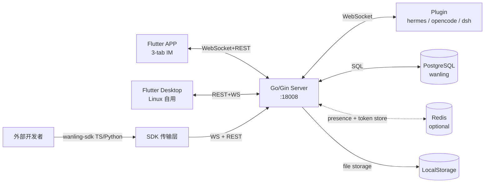

# 万灵架构总图

跨系统数据流 + 数据库关系。被各子 CLAUDE.md @import。

## 跨系统拓扑

## 关键数据流

- **消息流**: APP → WS → hub → message processor → PG + dispatch → receiver APP（含 Agent 过程消息：reasoning/tool_call/tool_result 等，由 opencode-plugin streamer 发）
- **session meta 流**(v1.0.9): OpenCode SDK `session.updated` SSE → plugin streamer.onSessionUpdated(按 mode|modelId|directory 去重) → `WanlingClient.updateSessionMeta` PATCH → server `conversations.session_meta` JSONB → APP `GET /api/conversations/:id` 读渲染副标题。**cwd/git_branch 同步**(v1.0.10): session.updated payload 含 `directory`(事件顶层字段) → streamer 调 `client.vcs.get({directory})` 拉当前 git branch → 连同 cwd 一起 PATCH 落 session_meta;运行中切分支由 `vcs.branch.updated` SSE 事件增量同步(streamer 维护 knownFullMeta 缓存防 server 覆盖写)。**实时刷新闭环**(v1.0.11): plugin PATCH 后 server 写库 + `BroadcastSessionMetaUpdateToUsers` 广播 `SESSION_META_UPDATE`(仅 user,断 plugin→OC 回环)→ APP chatProvider `_listenSessionMetaUpdate` 直接套 payload 替换 `chatState.sessionMeta`,SessionMetaStrip / EnvMetaStrip 即时刷新,不再依赖 agent 消息触发的 2s 防抖拉取(原路径拉到的是 plugin 上次写入的快照,无法刷新运行时变更)。plugin 三种触发时机:`session.updated`(mode/model/cwd 变)/ `vcs.branch.updated`(运行中切分支)/ **`step-finish reason=stop`**(agent 循环结束主动 vcs.get,兜底用户 shell 切分支场景 OC 不发 vcs 事件)。APP `EnvMetaStrip` widget 读 cwd/gitBranch 渲染「📁 项目名 · ⎇ 分支」。**token 展示**(v1.0.12):plugin 在 step-finish reason=stop 时主动 `session.get` 拉累计 `Session.tokens`(input+output+reasoning+cache.read+cache.write),连同本次 step_finish 的 input+cache.read(contextUsed) 和 provider 缓存的 model.limit.context(contextLimit),三字段随 session_meta PATCH 透传。APP EnvMetaStrip 末尾渲染 `· {contextUsed} · {pct}%`(主数字为当前上下文占用,非累计 token),pct = contextUsed / contextLimit。**APP → OC 反向**: APP 切 Build/Plan → 消息 content 带 `_mode` → plugin engine 读 `_mode` → `bridge.prompt(id, text, agent)` → SDK 用对应 agent 处理本条消息。**mode/model 是消息级属性**(SDK Session 无此字段),APP 端靠 sessionMeta 本地状态兜底
- **文件流**: APP `/api/upload` → file_handler → PG metadata + LocalStorage → `/api/files/:id` 下载(CheckAccess 四档放行)
- **审批 / 配对流**: 审批 Plugin adapter `send_exec_approval` → approval_handler → MESSAGE_CREATE → APP card → APPROVAL_DECIDED → resolve；配对 Plugin `install.sh --pair` → pairing → APP scan → complete → plugin 拿凭据

## 子系统边界

- **APP**: Flutter,仅 Android。详见 [app.md](./app.md)
- **Desktop**: Flutter Linux 桌面端(自用调试)。详见 [../desktop/README.md](../../desktop/README.md)
- **Server**: Go/Gin,转发+管理。详见 [server.md](./server.md)
- **Plugin**: hermes + opencode-plugin + dsh(deepseek-harness 桥,独立仓 dsh-wanling)。详见 [plugin.md](./plugin.md)
- **SDK**: TS + Python 传输层 SDK(npm `wanling-sdk` / PyPI `wanling-sdk`)。详见 [sdk.md](./sdk.md)

## 关键设计取舍

| 决策 | 选择 | 理由 |
|---|---|---|
| 服务端职责 | **只转发不跑模型** | 服务端是协议中介,不接管 Agent 适配层。LLM 在 Agent 平台跑,服务端零 GPU 负担 |
| Agent 接入 | **标准 WebSocket 协议** | hermes 已实现参考插件 |
| 鉴权 | **统一 JWT,role 区分** | user 和 agent 共用一套 JWT,role 字段区分身份,简单可扩展 |
| 消息可靠性 | **WS + OpResume 补发** | 断线后客户端携带最后 seq,服务端补发缺失 Dispatch,消息不丢 |
| Redis | **推荐必装** | 在线状态 / 多实例限流 / token refresh+黑名单+tokenver 走 Redis。不装可启动但降级为单机模式(在线状态恒离线、限流仅本实例有效、JWT 黑名单/tokenver fail-open 放行、refresh 返 503),多实例部署强烈建议安装 |
| APP 端 | **Flutter 单代码库** | 目前仅 Android 端 |
| 配对方式 | **扫码授权优先** | hermes 终端 `--pair` 生成二维码,APP 扫码选 Agent 自动下发凭据,替代手粘 user token |

## 项目级脚本(scripts/)

- `init_db.sh` — 一键建库 + 跑 migrations；`deploy.sh` — 本地编译 → rsync → systemctl restart(生产部署)
- `admin.sh` — 交互式管理菜单(加用户/重置密码/构建 APK/重启服务等)
- `build-plugin-binaries.sh` — 构建 opencode 插件单文件二进制产物（bun compile，免 NodeJS），输出 `release/`，发布时上传主仓库 Gitee release（镜像 repo 已废弃）
- `publish-sdk.sh` — 发布 SDK:TS `npm publish wanling-sdk` + Python `uv publish wanling-sdk`(版本独立演进)
- `send_test_message.py` — **消息测试工具**(开发调试用)。以 agent 身份给指定 user 发消息,支持 `--count N --interval X` 连发测试未读浮标链路。流程: agent_id+secret_key 换 JWT → 连 WS 完成 Hello/Identify → 发 MESSAGE_CREATE。环境变量 `WANLING_AGENT_ID` / `WANLING_SECRET_KEY` / `WANLING_USER_ID` 兜底(凭证可写在 `scripts/.test_env.local`,被 `scripts/.gitignore` 忽略)
