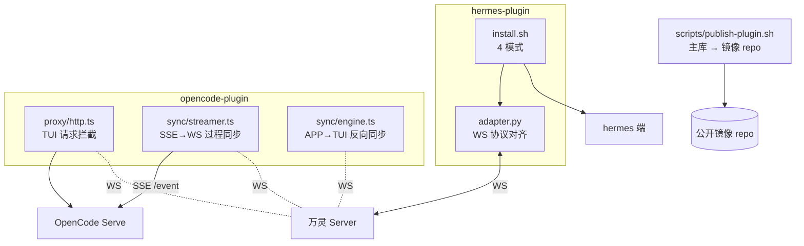

# Plugin 架构

插件总目录。主库 plugin/ = 权威源,公开镜像 repo 同步分发。当前两个插件：hermes-plugin（Python，18 平台 IM 适配）+ opencode-plugin（TypeScript，OpenCode CLI/TUI 桥接）。

## 子系统拓扑

## 组件清单(按目录)

### hermes-plugin

- **install-remote.sh** — 总入口引导（被用户 curl，支持 `--plugin=<name>` 选插件，默认 hermes-plugin，下载后 exec 调用插件的 install.sh）
- **hermes-plugin/install.sh** — 4 模式实现：默认安装 / `--update`（只同步代码）/ `--config`（只改配置）/ `--pair`（扫码配对，见扫码配对专题）；支持 `--profile=<name>` 多 profile
- **hermes-plugin/adapter.py** — WS 协议对齐 + `send_exec_approval` / `send_slash_confirm` + `_on_approval_decided` / `_on_approval_expired`。**chat_id 概念 = conversation_id**(对齐 hermes 上游 18 平台),所有 WS payload 走新协议 `{conversation_id, content}`,无 user_id 路由。**引用消息双向**(对齐飞书):
  - **入站** `_on_message_create`:抽 `content.data.quote` 子对象 → 填 `MessageEvent.reply_to_message_id`(quote.message_id) + `MessageEvent.reply_to_text`(quote.preview),让 LLM 通过 reply_to_text 拿到被引用消息作为上下文
  - **出站** `send` **透传 `reply_to`**:hermes 上游 `_reply_anchor_for_event(event)` 默认每次回复都传 reply_to = 触发消息的 message_id(对齐飞书 / Telegram 等 18 平台的「回复锚点」语义)。adapter 把 reply_to 注入 `content.data.quote = {"message_id": reply_to}`,server `enrichQuote` 富化 sender_name / preview 后,APP 端在 agent 回复气泡上方渲染引用块。LLM **不需要知道 message_id**,hermes 全栈无暴露消息 id 给 LLM 的机制,这是 IM 标准交互

### opencode-plugin

- **opencode-plugin/install.sh** — 安装脚本，`--pair` 扫码配对（复用 hermes 同一套 QR 协议），配置写入 `~/.config/opencode-wanling/config.json`
- **opencode-plugin/src/proxy/http.ts** — TUI HTTP 代理（:5096），拦截 `POST /session/:id/message` 同步用户消息到万灵（msg_type=`tui_user`，不再同步 AI 回复，改由 streamer 统一推送）。**入口 Basic Auth 鉴权(1.2.1+)**：password 取自 config.json 的 `proxyPassword`（首次启动自动生成、chmod 600 的 SSH-host-key 模式，`WANLING_PROXY_PASSWORD` 可覆盖）。**onUserSession 回调**：拦截用户消息时同时通知 streamer 更新 mainSessionId（解决用户 attach 新 session 后事件被旧 session 过滤丢弃的问题）
- **opencode-plugin/src/control/api.ts** — 运维 Control API（:19780，`/status` 等）。**Bearer token 鉴权(1.2.1+)**：token 每次启动随机生成，打印在启动日志 `[control] API token:`，请求需带 `Authorization: Bearer <token>`
- **opencode-plugin/src/sync/streamer.ts** — SSE 事件流→万灵 WS 过程同步引擎(组装根)。订阅 `GET /global/event`,按完整语义单元聚合后发消息(reasoning/tool_call/tool_result/tool_error/step_finish/file_diff/markdown)。已拆解为 **SessionStore**(共享状态仓) + **MessageRouter**(发送路由) + 6 个领域模块(MetaSync 元数据同步 / ToolCardManager 工具卡片状态机 / PartDispatcher 文本推理分发 / CompactionTracker 压缩分隔符 / InteractionCards 交互卡片 / SessionLifecycle 状态心跳 flush)。`start()` wire 三路 part_updated 订阅 + session 状态/交互事件;`updateMainSessionId` 由 proxy onUserSession 回调触发动态切换主 session。模块结构、职责一句话清单、组装根职责详见 [@plugin/opencode-streamer.md](@plugin/opencode-streamer.md)
- **opencode-plugin/src/sync/engine.ts** — APP→TUI 反向同步（万灵 WS message → OpenCode prompt 注入）。**reply 路由**: 在 text 检查前分派 `permission_reply` / `question_reply`，通过 bridge.ts 调 v2 SDK 的 `replyPermission` / `replyQuestion` / `rejectQuestion`。**prompt 改 async**: `promptWithRetry` 调 `bridge.promptAsync`(SDK `session.promptAsync`,立即返回 204,实际 LLM 响应走 SSE 由 streamer 推送)替代同步 `prompt`。同步 prompt 的 HTTP 响应等 LLM 生成完(数分钟),配合重试会放大重复写入(消息重放 bug 根因),async 把"慢"从 HTTP 层剥离到 SSE 层。**mode 透传**: 读 `data._mode`(APP 切 Build/Plan 时随消息带上)作 `agent` 参数透传给 `bridge.promptAsync(sessionId, text, agent)`,让 SDK 用对应 agent 处理本条消息(build/plan/general/explore)。**_slash 分支**(vTBD): `handleIncomingMessage` 新增分支，payload 含 `data._slash = {name, args}` 字段时调 `bridge.runCommand`（封装 v2 `client.session.command`），与 promptAsync 互斥，`_mode`/`_model` 被忽略。**标题同步(万灵→OC)**: 监听 `wanling.conv_update` 事件(APP 改会话名 → server 广播 CONVERSATION_UPDATE → client.ts emit),查 mapper 拿 ocSessionId 调 `bridge.renameSession` 改 OC 端标题。单向同步:OC 端回 session.updated 触发的 server 广播只发给 user(`BroadcastConversationUpdateToUsers`),插件收不到自己触发的回声,物理断环无噪声
- **opencode-plugin/src/opencode/bridge.ts** — OpenCode Serve 桥接(拉起 :4096)。`promptAsync(sessionId, text, agent?)` 封装 SDK `session.promptAsync`(立即返回 204,不等 LLM,响应走 SSE);旧 `prompt`(同步等 LLM)保留但 engine 不再用。`getSessionTitle(id)` 取 session 可读标题(ensureConversation 改名用)。`renameSession(id, title)` 封装 SDK `session.update` PATCH 标题(404 幂等忽略)。`runCommand(sessionId, name, args, agent?, model?)` 封装 v2 `session.command`（POST /session/{id}/command），透传 agent/model override（对称 promptAsync 语义，async 不等 LLM；model 序列化为 `providerID/modelID` 字符串以兼容 OC API 类型不一致）。（engine `_slash` 分支当前未透传 agent/model，与 `_mode`/`_model` 互斥）。扩展 v2 client 暴露 `replyPermission` / `replyQuestion` / `rejectQuestion` 三个 wrapper
- **opencode-plugin/src/opencode/subscriber.ts** — SSE 事件订阅 + 分发。`SessionUpdatedPayload` 扩展 mode(=info.agent) + model{id, providerID, variant},让 streamer 拿到完整 session 元数据。新增 `session_updated` 事件分发
- **opencode-plugin/src/sync/ensure_conversation.ts** — 主 session 首次出现时调 `wanling.createGroupAsAgent(type, title, {userId})` 建 agent_session 群 + `wanling.updateConversationTitle` 异步改名(用 `bridge.getSessionTitle` 取 OC session 标题),in-flight 防重(Map 锁)。SessionStore.getOrCreateState 调用
- **opencode-plugin/src/sync/card_store.ts** — 内存 cache + 持久化备份 `~/.config/opencode-wanling/pending-cards.json`，映射 oc_request_id ↔ {msg_id, conv_id, type, createdAt}，用于 streamer 反向流去重。`getAllCards()` 供 streamer 启动时清理孤儿卡片
- **opencode-plugin/src/wanling/client.ts** — 万灵 WS + REST 客户端。REST 扩展:`createGroupAsAgent`(agent 视角建会话)、`updateConversationTitle`(agent 改名)、`updateSessionMeta`(同步 mode/model/variant/modelName/providerName/**cwd/gitBranch** 到 server)
- **opencode-plugin/src/utils/logger.ts** — 轻量日志分级（debug/info/warn/error），`WANLING_LOG_LEVEL` 环境变量控制，默认 info。bridge/subscriber 的诊断日志走 logger.debug，生产默认不输出

**adapter WS 协议对齐关键约束**（两插件共用）：
- 握手必须先 Identify（server ws_handler 强制首条 Identify）
- 注册成功后再发 OpResume（`_last_seq > 0` 时）补发断线期间 dispatch
- `message_id` 用短 UUID（不用时间戳，防跨客户端冲突）

## 详情文件

- `plugin/hermes-deploy.md` — Hermes Plugin 部署运维（安装 / Gateway / 多 Profile / 配对运维 / 安全检查）
- `plugin/opencode-streamer.md` — OpenCode Plugin Streamer 模块结构(组装根 + SessionStore + MessageRouter + 6 领域模块职责清单)

> 审批通道详细（exec_approval / slash_confirm + 决策回传 4 步链路）见 [@../ai-handbook/approval-card.md](@../ai-handbook/approval-card.md)
> 扫码配对三方握手详细见 [@../ai-handbook/qr-pair.md](@../ai-handbook/qr-pair.md)
