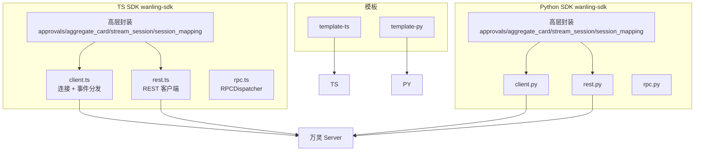

# SDK 架构

仓库根 `sdk/`,对外发布双语言传输层 SDK,统一外部 plugin 接入。

## 子系统拓扑

## 组件清单

- `sdk/ts/src/client.ts` / `sdk/python/wanling_sdk/client.py` — WS 连接生命周期(token 换取 + Hello/Identify/Heartbeat/Resume + 重连)+ 事件分发 + 发送/上报方法。从 opencode-plugin `wanling/client.ts` 抽取演进
- `sdk/ts/src/rest.ts` / `sdk/python/wanling_sdk/rest.py` — REST 客户端(agent 视角会话/消息/文件/审批)。方法:sendCardMessage/updateMessageContent/**createApproval**(审批状态机,含 allow_pattern 白名单/question 的 options+multi_select)/**getApproval**(decided/decided_answers 兜底查询)/listAgentConversations/listAgentSessions/**patchAggregateMessage**(聚合卡增量 op,对齐 aggregate-card.md)/recallMessage/上传上限可配置(默认 32MB 对齐 server UPLOAD_MAX_BYTES);sendCardMessage 默认 silent=true 仅适合卡片/过程消息,发普通回复须显式 silent=false
- `sdk/ts/src/rpc.ts` / `sdk/python/wanling_sdk/rpc.py` — RPCDispatcher(`register`(TS) / `register_method`(Python) 注册 + PluginCall 分发 + PluginResult 回发)
- `sdk/ts/src/approvals.ts` / `sdk/python/wanling_sdk/approvals.py` — **Approvals** 审批/提问高层封装:`ask(convId, opts)` 建卡 + 监听 APPROVAL_DECIDED/EXPIRED 决议 Promise,超时兜底 + 重连 resync;协议对齐 approval-card.md
- `sdk/ts/src/aggregate_card.ts` / `sdk/python/wanling_sdk/aggregate_card.py` — **AggregateCard** 聚合卡状态机:append/update/finish/interrupt,建卡幂等 + PATCH 串行队列 + 20 元素自动分卡 + 降级全量替换自愈;协议对齐 aggregate-card.md
- `sdk/ts/src/stream_session.ts` / `sdk/python/wanling_sdk/stream_session.py` — **StreamSession** op=14 流式会话:push/end/abort,节流 + 累积全量快照帧
- `sdk/ts/src/session_mapping.ts` / `sdk/python/wanling_sdk/session_mapping.py` — **SessionMapping** session↔conversation 本地 JSON 映射:ensureConversation 幂等建会话 + bySession/byConversation 查询
- `sdk/templates/` — 最小 agent 插件脚手架

## 事件映射(两语言一致)

| server 事件 | SDK 事件名 |
|---|---|
| MESSAGE_CREATE / TYPING_START / GENERATION_ABORT | message / typing / abort |
| MESSAGE_UPDATE / MESSAGE_DELETE / MESSAGE_READ | message.update / message.delete / message.read |
| CONVERSATION_UPDATE / PARTICIPANT_JOIN / LEAVE | conv_update / conv.participant.join / conv.participant.leave |
| SESSION_META_UPDATE | session.meta.update |
| APPROVAL_DECIDED / APPROVAL_EXPIRED | approval.decided / approval.expired |
| AGENT_ONLINE / AGENT_OFFLINE | agent.online / agent.offline |

## 关键设计

- 传输层 SDK:业务逻辑(消息路由/与自家引擎对接)由开发者自己写
- 协议权威源:`server/internal/model/opcodes.go` + `docs/ai-handbook/websocket-protocol.md`
- 对照表单测(TS `opcodes.test.ts` / Python `test_opcodes.py`)锁定 opcodes 防漂移
- 聚合卡增量:`patchAggregateMessage(msgId, op)` 走 server `applyContentOp` 增量合并,与全量替换 `updateMessageContent` 互补(全量替换会被 mergePreservedSilent 保留 silent,不适合驱动翻转)
- silent 语义:`sendCardMessage` 默认 silent=true(静默/不计未读,适合卡片),普通文本回复用 `sendTypedMessage`(默认非 silent)或显式 `silent:false`
