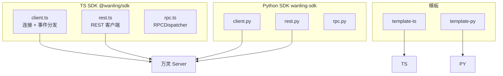

# SDK 架构

仓库根 `sdk/`,对外发布双语言传输层 SDK,统一外部 plugin 接入。

## 子系统拓扑

## 组件清单

- `sdk/ts/src/client.ts` / `sdk/python/wanling_sdk/client.py` — WS 连接生命周期(token 换取 + Hello/Identify/Heartbeat/Resume + 重连)+ 事件分发 + 发送/上报方法。从 opencode-plugin `wanling/client.ts` 抽取演进
- `sdk/ts/src/rest.ts` / `sdk/python/wanling_sdk/rest.py` — REST 客户端(agent 视角会话/消息/文件/审批)
- `sdk/ts/src/rpc.ts` / `sdk/python/wanling_sdk/rpc.py` — RPCDispatcher(`register`(TS) / `register_method`(Python) 注册 + PluginCall 分发 + PluginResult 回发)
- `sdk/templates/` — 最小 agent 插件脚手架

## 事件映射(两语言一致)

| server 事件 | SDK 事件名 |
|---|---|
| MESSAGE_CREATE / TYPING_START / GENERATION_ABORT | message / typing / abort |
| MESSAGE_UPDATE / MESSAGE_DELETE / MESSAGE_READ | message.update / message.delete / message.read |
| CONVERSATION_UPDATE / PARTICIPANT_JOIN / LEAVE | conv_update / conv.participant.join / conv.participant.leave |
| SESSION_META_UPDATE | session.meta.update |
| APPROVAL_DECIDED / APPROVAL_EXPIRED | approval.decided / approval.expired |
| AGENT_ONLINE / AGENT_OFFLINE | agent.online / agent.offline |

## 关键设计

- 传输层 SDK:业务逻辑(消息路由/与自家引擎对接)由开发者自己写
- 协议权威源:`server/internal/model/opcodes.go` + `docs/ai-handbook/websocket-protocol.md`
- 对照表单测(TS `opcodes.test.ts` / Python `test_opcodes.py`)锁定 opcodes 防漂移
