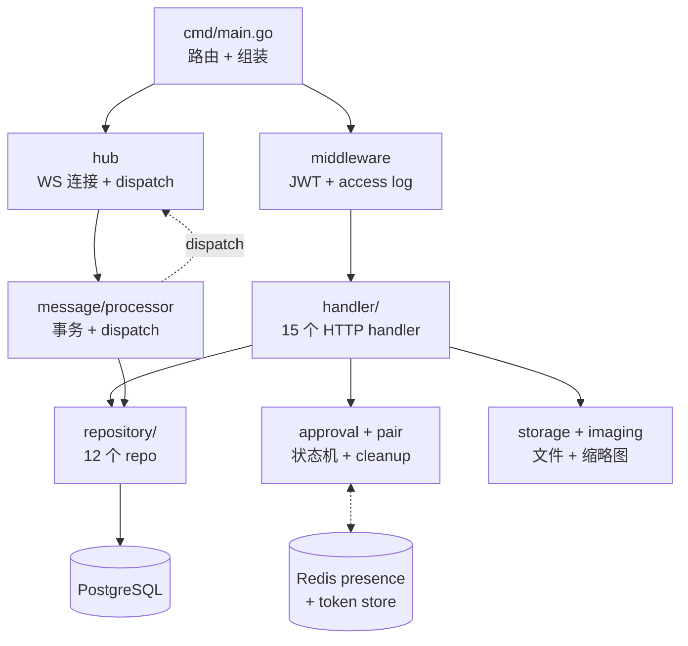

# Server 架构

Go/Gin :18008,消息转发 + 用户/Agent 管理,不含 Agent 适配层。

## 子系统拓扑

## 组件清单

### 入口与认证
- `cmd/main.go` — 入口,组装依赖 + 注册路由(路由组角色限制 / 限流策略见详情)。详见 [entry.md](./server/entry.md)
- `internal/auth/jwt.go` — JWT 认证,role 字段区分 user/agent,claims 含 jti(黑名单)+ ver(tokenver)。详见 [entry.md](./server/entry.md#authjwtgo)
- `internal/auth/token_store.go` — Redis token store(refresh token rotation / jti 黑名单 / tokenver 版本号)。详见 [entry.md](./server/entry.md#authtoken_storego)

### HTTP Handler(15 个)
- `internal/handler/` — HTTP Handler 集合,涵盖 auth/user/agent/conversation/approval/ws/send/message/file/pairing/mini_program + middleware/access_log;mini_program 含 admin 审核端点 `GET /api/admin/mini-programs` + `PUT /api/admin/mini-programs/:id/status`(旧路径 `PUT /api/mini-programs/:id/status` 保留兼容别名)。详见 [handlers.md](./server/handlers.md)

### 实时通道
- `internal/hub/` — WS 连接管理器(SendToUser/Agent/Conv + 3 个审批广播 helper)。详见 [realtime.md](./server/realtime.md#hub)
- `internal/message/processor.go` — 消息事务处理(事务保证持久化 + unread_count + hidden_at 原子性)。详见 [realtime.md](./server/realtime.md#messageprocessor)
- `internal/agent/registry.go` — 进程级内存缓存 plugin 上报的可选模型清单（`AgentRegistry`）。`AGENT_MODELS` 事件写入，`GET /api/agents/:id/models` 读取。`sync.RWMutex` 保护并发 Update/Get，`Get` 返防御性拷贝，server 重启清空 plugin 重连重报
- `internal/agent/slash_catalog_registry.go` — **`SlashCatalogRegistry`** 与 `AgentRegistry` 同构，存 plugin 上报的命令清单。`AGENT_SLASH_CATALOG` 事件写入，`GET /api/agents/:id/slash-catalog` 读取。server 重启清空，plugin 重连重报

### 数据层
- `internal/repository/` — 12 个 repo:核心 IM 五件套(Conversation / Participant / Message / Delivery / File,含四档放行 CheckAccess)+ 账户与社交(User / Agent / Friendship)+ 状态机持久化(Approval / Pairing)+ 类型注册表(AgentType,011)+ 小程序注册表(MiniProgram,012)。详见 [data.md](./server/data.md)
- `internal/model/null_json.go` — NullJSON 类型(可空 JSONB 字段处理)。详见 [data.md](./server/data.md#modelnull_jsongo)

### 支撑组件
- `internal/storage/` — 文件存储抽象(本地实现,预留 MinIO)。详见 [support.md](./server/support.md#storage)
- `internal/imaging/` — 缩略图生成(600px JPEG q85)。详见 [support.md](./server/support.md#imaging)
- `internal/config/config.go` — 环境变量配置加载(必填项缺失 fail-fast)。详见 [support.md](./server/support.md#config)
- `internal/presence/` — Redis 在线状态(幂等 SET + 内存降级)。详见 [support.md](./server/support.md#presence)
- `internal/approval/` — 审批状态机编排 + 超时清理 goroutine。详见 [support.md](./server/support.md#approval)
- `internal/miniprogram/` — 小程序 zip 包结构校验纯函数(fail-fast,防解压炸弹/路径穿越)。详见 [support.md](./server/support.md#miniprogram)
- `internal/version/` — server 版本号(Version + BuildCommit),编译时 ldflags 注入(`-X github.com/wanling/server/internal/version.Version=...`),`/health` 返回。本地 go run 用默认值
