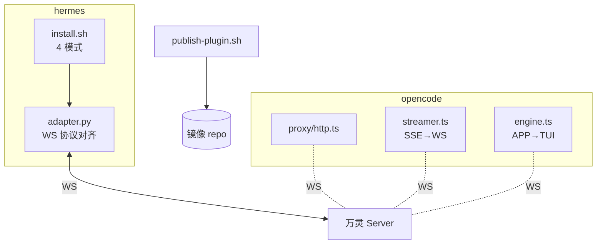

# plugin/CLAUDE.md

万灵插件总目录。主库 plugin/ = 权威源（日常开发在此改），公开镜像 repo 同步分发。Claude Code 在 plugin/ 目录工作时自动加载本文件 + 根 CLAUDE.md。

## 子系统身份

`plugin/` 是插件总目录，每个子目录是一个独立插件：
- **hermes-plugin/** — Python，主流 IM 平台适配（hermes 框架），WS 直连万灵 server
- **opencode-plugin/** — TypeScript，OpenCode CLI/TUI 桥接，proxy(:5096) + SSE streamer + 反向 sync engine

插件代码可公开，与主库私有代码解耦。

- **主库 `plugin/`** = 权威源（日常开发在此改，经常和 server 同步改协议）
- **公开镜像 repo**：`gitee.com/luoyu318/wanling-plugin`（镜像 repo 根 = 主库 `plugin/` 内容）

## 开发命令

- **hermes-plugin**:
  - **`plugin/install-remote.sh`** — 总入口引导脚本（被用户 curl），支持 `--plugin=<name>` 选插件（默认 hermes-plugin），下载后 exec 调用插件的 install.sh
  - **`plugin/hermes-plugin/install.sh`** — 实际安装脚本，四模式：默认安装 / `--update`（只同步代码）/ `--config`（只改配置）/ `--pair`（扫码配对，见扫码配对专题），支持 `--profile=<name>` 多 profile
- **opencode-plugin**:
  - `cd plugin/opencode-plugin && npm install && npx tsc` — 编译 TypeScript
  - `node dist/index.js` — 启动（自动拉起 OpenCode Serve :4096 + proxy :5096）
  - `opencode attach http://localhost:5096` — TUI 连接 proxy
  - systemd 服务 `opencode-wanling`（用户级，`systemctl --user restart opencode-wanling`）
  - `install.sh` 支持多实例隔离：`--config-dir` / `--service-name` / `--opencode-port` / `--proxy-port` / `--control-port` flag，unit 注入 `WANLING_CONFIG_DIR`。同机多套详见 `docs/deployment-source.md`「同机多实例」节
- **`scripts/publish-plugin.sh`** — 发布：`PUBLISH_REPO_DIR=<镜像 repo 本地路径> ./scripts/publish-plugin.sh`，用 rsync 同步整个 `plugin/` 到镜像 repo（排除 `.git/`、`__pycache__`），从 `hermes-plugin/plugin.yaml` 读 version 打 tag

用户一键安装：
```bash
curl -fsSL https://gitee.com/luoyu318/wanling-plugin/raw/main/install-remote.sh | \
  bash -s -- --server=URL --agent-id=ID --secret-key=KEY
```

## 架构(概要)



详细组件清单(install-remote / install.sh 4 模式 / adapter 协议约束)见 [@../docs/architecture/plugin.md](@../docs/architecture/plugin.md)

## 测试规约

- **hermes-plugin**: 当前无自动化测试，靠 hermes 端 dry-run。install.sh 改动后，在测试 profile 跑 4 模式回归（默认 / `--update` / `--config` / `--pair`）
- **opencode-plugin**: `cd plugin/opencode-plugin && npx tsc` 零 error + `npx eslint src/` 零 error + `npx vitest run` 全绿。改动后重启 systemd 服务 `systemctl --user restart opencode-wanling`
- **Lint**: `cd plugin/opencode-plugin && npx eslint src/`（配置见 `plugin/opencode-plugin/eslint.config.js`，flat config + typed linting）

## 跨系统协议(@import)

@../docs/architecture/overview.md
@../docs/ai-handbook/websocket-protocol.md
@../docs/ai-handbook/aggregate-card.md
@../docs/ai-handbook/rpc-protocol.md
@../docs/ai-handbook/rpc-methods.md
@../docs/ai-handbook/approval-card.md
@../docs/ai-handbook/qr-pair.md
@../docs/ai-handbook/rest-response.md
