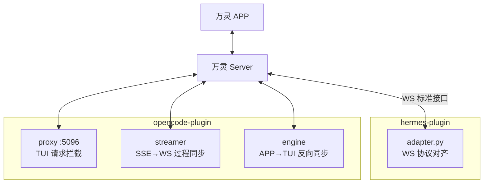

# Wanling 插件

万灵（Wanling）IM 平台的 Agent 接入插件集合。每个子目录是一个独立插件，通过标准 WebSocket 接口把 Agent 平台接入万灵 server —— APP 里每个 Agent 背后就是一个插件实例。

`plugin/` 是权威源（日常开发在此改），公开镜像 repo `gitee.com/luoyu318/wanling-plugin` 同步分发（可 curl 安装的插件走镜像）。

## 插件概览

| 插件 | 语言 | 场景 | 安装方式 | 文档 |
|---|---|---|---|---|
| `hermes-plugin/` | Python | 主流 IM 生态 Agent（hermes 框架），WS 直连万灵 | curl 一键 / 扫码配对 | 本文件 |
| `opencode-plugin/` | TypeScript | OpenCode CLI/TUI ↔ APP 双向同步（proxy + SSE streamer） | 独立安装 | [opencode-plugin/README.md](./opencode-plugin/README.md) |

## 架构



- 插件经标准 WS 协议接入，服务端不绑定具体 Agent 平台（不存适配层）
- 两插件共用握手约束：首条 Identify → 注册成功 → 断线 OpResume 补发
- 详细组件拆解见仓库 `docs/architecture/plugin.md`（镜像 repo 不包含 docs，请到主仓库查看）

## Hermes Plugin

把主流 IM 生态的 hermes Agent 接入万灵。

### 一键安装

```bash
curl -fsSL https://gitee.com/luoyu318/wanling-plugin/raw/main/install-remote.sh | \
  bash -s -- --server=https://your.server.com --agent-id=YOUR_AGENT_ID --secret-key=YOUR_SECRET_KEY
```

`--plugin` 支持指定插件名（默认 `hermes-plugin`）：

```bash
curl -fsSL https://gitee.com/luoyu318/wanling-plugin/raw/main/install-remote.sh | \
  bash -s -- --plugin=hermes-plugin --server=... --agent-id=... --secret-key=...
```

> `--plugin` 仅支持 hermes 布局插件（含 `adapter.py` + `install.sh` 的可 curl 安装插件）；`opencode-plugin` 是编译型 TypeScript 插件，需走独立安装流程（见其 README）。

参数说明（除 `--plugin` 由远程脚本消费外，其余透传给插件的 install.sh）：

- `--server=URL`：wanling server 地址（必填）
- `--agent-id=UUID`：agent ID（必填）
- `--secret-key=KEY`：agent 密钥（必填）
- `--home-user=UID`：可选，cron 投递目标用户
- `--profile=NAME`：可选，装到指定 hermes profile
- `--register`：可选，自动在 server 注册新 agent（需 `--user-token`）

交互式安装（不带参数，会逐个问）：

```bash
curl -fsSL https://gitee.com/luoyu318/wanling-plugin/raw/main/install-remote.sh | bash
```

装完后重启 hermes gateway：

```bash
hermes gateway restart
```

### 扫码配对（推荐，无需 user token）

用万灵 app 扫码授权，hermes 终端自动拿凭据完成配置。相比一键安装，扫码配对**不需要提前复制 agent_id/secret_key**，也**不需要粘 user token**。

```bash
./install.sh --pair
./install.sh --pair --server=https://your.server.com --profile=heiyu
```

远程一键（curl | bash）：

```bash
curl -fsSL https://gitee.com/luoyu318/wanling-plugin/raw/main/install-remote.sh | \
  bash -s -- --pair --server=https://your.server.com
```

> ⚠️ 远程方式**必须显式传 `--server=`**：`curl | bash` 下 stdin 是管道不是终端，install.sh 无法交互式询问 server URL。

流程：脚本生成授权二维码（需 `qrencode` 或 `python3+qrcode`）→ 万灵 app「万灵」tab 右上角 `+` → 扫一扫 → 选已有 Agent（会重置密钥使旧终端失效）或新建 → hermes 终端自动轮询拿凭据并完成配置。凭据仅配对时短暂落盘，终端领取后立即清空（领完即焚），5 分钟内未完成自动过期。

### 更新插件

```bash
curl -fsSL https://gitee.com/luoyu318/wanling-plugin/raw/main/install-remote.sh | \
  bash -s -- --update
```

同步最新代码到所有已装位置，不动配置。

### 前置要求

- 已安装 hermes-agent
- 已在 wanling server 注册 agent（拿到 agent_id + secret_key）

## OpenCode Plugin

把 OpenCode CLI/TUI 与万灵 APP 双向实时同步，实现 TUI ↔ APP 对话连续。

- **安装**：独立流程，`./install.sh --pair` 扫码配对（推荐）或手动安装，详见 [opencode-plugin/README.md](./opencode-plugin/README.md)
- **启动**：`systemctl --user start opencode-wanling`（或 `node dist/index.js` 前台）
- **连 TUI**：`ocwl`（自动鉴权 + 当前目录）或 `opencode attach http://localhost:5096`
- **运维**：`ocwl-restart` 重启 / `ocwl-logs` 实时日志 / 多实例用 `install.sh --config-dir=...` 隔离

## 公共协议（两插件共用）

协议细节见仓库 `docs/ai-handbook/`（镜像 repo 不包含 docs，请到主仓库查看）：

- **WS 协议**：握手 Identify → 注册成功 → 断线 OpResume 补发（`docs/ai-handbook/websocket-protocol.md`）
- **扫码配对**：三方握手 / 领完即焚 / 5 分钟过期（`docs/ai-handbook/qr-pair.md`）
- **审批卡片**：危险命令 / 工具 / 文件决策卡片（`docs/ai-handbook/approval-card.md`）
