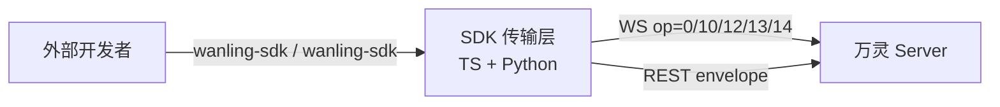

# sdk/CLAUDE.md

万灵 Plugin SDK,仓库根 `sdk/`,对外发布 TypeScript + Python 双语言传输层 SDK,供外部开发者接入万灵 server 成为 agent 插件。

## 子系统身份

- `sdk/ts` → npm 包 `wanling-sdk`:连接生命周期 + 协议编解码 + REST + RPC + 流式 + 能力上报
- `sdk/python` → PyPI 包 `wanling-sdk`(UV 管理):与 TS 对称,`asyncio` + `websockets` + `httpx`
- `sdk/templates` → 最小 agent 插件脚手架(template-ts / template-py)

## 高层封装四类(TS/Python 对称,经 client 工厂取用)

- `client.approvals`(`Approvals`):`ask(convId, opts)` 发审批/提问卡并 Promise 决议 `{state: approved|denied|expired, decision, answers?}`;监听 APPROVAL_DECIDED/EXPIRED 匹配 approval_id,超时本地兜底,重连后 `resync()` REST 兜底。deny/reject/cancel 映射 denied
- `client.aggregate(convId, opts)`(`AggregateCard`):聚合卡状态机——`append`/`update`/`finish(footer)`/`interrupt()`,建卡幂等 + PATCH 串行队列 + 20 元素自动分卡 + 降级全量替换自愈(`degradedSelfHeal`)/空卡撤回(`recallEmpty`,Python 下划线 `degraded_self_heal`/`recall_empty`)
- `client.stream(convId, opts)`(`StreamSession`):op=14 流式——`push(delta)`/`end(finalText)`/`abort()`,节流(默认 300ms)+尾部兜底,帧为累积全量快照;`aggregate` 选项定位卡内元素
- `client.sessionMapping(path)`(`SessionMapping`):本地 JSON 持久化 session→conversation 映射,`ensureConversation(sessionId, opts)` 不存在则建(agent_session),`bySession`/`byConversation` 查询,`remove` 清理

## 开发命令

```bash
# TS
cd sdk/ts && npm install && npx vitest run && npx eslint src/ test/ && npx tsc --noEmit

# Python(UV)
cd sdk/python && uv sync
cd sdk/python && uv run pytest -v
cd sdk/python && uv run ruff check wanling_sdk tests

# 统一入口(已并入 make lint / test / check)
make lint-sdk   # eslint + ruff
make test-sdk   # vitest + pytest
```

## 架构(概要)



## 协议同步规则

- opcodes 常量以 `server/internal/model/opcodes.go` 为单真相源,改动 server 协议必须同步 `sdk/ts/src/opcodes.ts` + `sdk/python/wanling_sdk/opcodes.py` + 各自对照表单测
- 事件命名两语言一致,见 `docs/architecture/sdk.md` 事件表
- REST 方法遵循 `docs/ai-handbook/rest-response.md` envelope
- 审批接口(createApproval)字段对齐 `server/internal/handler/approval_handler.go` CreateApproval(card_type 枚举含 question/session_key/allow_pattern/confirm_id);`Approvals.ask`/question 协议对齐 `docs/ai-handbook/approval-card.md`
- 聚合卡增量(patchAggregateMessage)对齐 `docs/ai-handbook/aggregate-card.md` 增量 op,改动 server 增量协议必须同步;`AggregateCard`/`StreamSession` 是该协议的高层封装,行为变更双向同步

## 发布

```bash
scripts/publish-sdk.sh   # npm publish + uv publish,版本独立演进
```

SDK 不进 gitee 镜像 repo(镜像只分发可 curl 安装的 plugin)。
