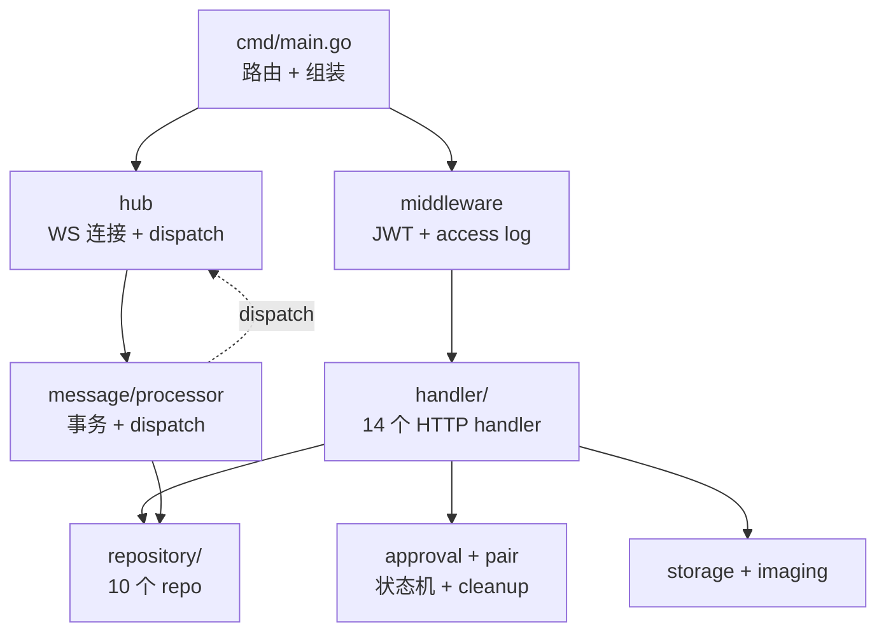

# server/CLAUDE.md

万灵服务端 Go/Gin,仅做消息转发 + 用户/Agent 管理。Claude Code 在 server/ 目录工作时自动加载本文件 + 根 CLAUDE.md。

## 子系统身份

Go/Gin :18008,仅做消息转发 + 用户/Agent 管理,不含 Agent 适配层。Agent 平台通过标准 WebSocket 接口接入。

## 开发命令

```bash
cd server
go run cmd/main.go                 # 启动服务（需先配置 .env，监听 :18008）
go test ./...                      # 运行全部测试（用 testcontainers 起 PG 容器，需 docker）
go test ./internal/hub/...         # 运行指定包测试
```

> 测试用 `testcontainers-go` 起一次性 PG 容器（`internal/repository/testdb.go` 的 `SetupTestDB`）。**禁止 mock 数据库**，所有 repo 测试连真库。CI=1 环境会跳过（runner 通常无 docker）。

## 架构(概要)



详细组件清单(逐个 cmd/ + internal/ 包职责 + 关键设计点)见 [@../docs/architecture/server.md](@../docs/architecture/server.md)

## 认证体系

统一 JWT，`role` 字段区分身份：
- 用户：用户名密码登录获取 `{ sub: user_id, role: "user" }`
- Agent：`agent_id + secret_key` 换取 `{ sub: agent_id, role: "agent", owner: user_id }`

中间件 `handler.AuthMiddlewareWithStore` 根据 role 校验权限，把 `userID` / `role` 写入 gin.Context（`handler.AuthMiddleware` 仅是旧名兼容别名）。

## WS 配置

- `WS_ALLOWED_ORIGINS`:逗号分隔的 Origin 白名单(如 `http://localhost:3000,https://wanling.example.com`)
- 配置非空 → 仅白名单内 Origin 可建 WS(开发多域名场景用)
- 配置为空 → 同源校验(Origin host == Host header),适合单域名生产
- 缺 Origin 头(plugin adapter 等非浏览器 client)始终放行

## 测试规约

- `internal/repository/testdb.go` 提供 `SetupTestDB(t)` 起 testcontainers PG 容器，所有 repo 测试连真库（**禁止 mock**）。
- Handler 测试用 `httptest` + gin，覆盖 happy path + 4xx/5xx 分支。
- 测试中 username 用 `shortName(t, prefix)` helper 截断（避免超 varchar(64)）。
- **Lint**: `cd server && golangci-lint run ./...`（配置见 `server/.golangci.yml`，9 linter + 审计驱动的 exclude-rules）
- **模板**: 新增 handler/repo/migration 从 `templates/go-*.tmpl` 复制骨架

## Repository 层 ctx 约定

- **所有 repo 方法必须接 `ctx context.Context` 首参**(包括 *Tx 方法,ctx 在 tx 之前)
- **禁止直接调 `r.db.QueryRow/Exec/Query` 非 Context 变体** — 必须通过 queryExecutor 封装(`r.queryRow(ctx, ...)` / `r.exec(ctx, ...)` / `r.query(ctx, ...)`)
- 17 个 `*Tx` 方法签名 `CreateTx(ctx, tx, ...)`,方法体内调 `tx.QueryRowContext(ctx, ...)` / `tx.ExecContext(ctx, ...)` 显式消费 ctx
- CI lint `scripts/check-repo-ctx.sh` 强制约束(本地 pre-commit + CI pipeline 双兜底)
- 新增 repo 方法时,务必按上述模板写,否则 lint 会失败

## 跨系统协议(@import)

@../docs/architecture/overview.md
@../docs/ai-handbook/websocket-protocol.md
@../docs/ai-handbook/aggregate-card.md
@../docs/ai-handbook/rpc-protocol.md
@../docs/ai-handbook/rpc-methods.md
@../docs/ai-handbook/approval-card.md
@../docs/ai-handbook/qr-pair.md
@../docs/ai-handbook/migrations.md
@../docs/ai-handbook/rest-response.md
